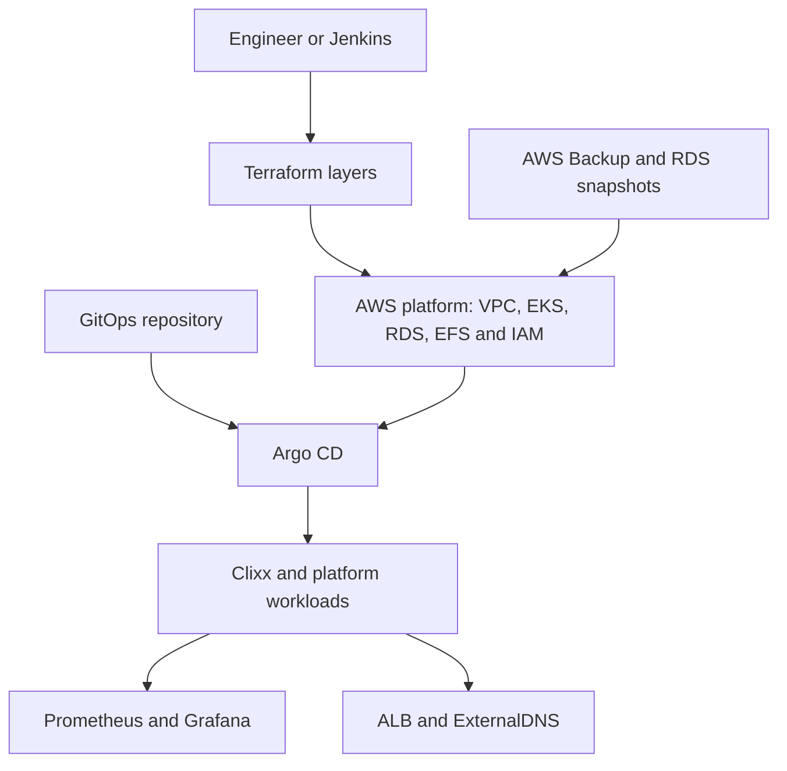

## Executive summary

The Clixx platform is a production-style AWS Kubernetes environment designed to demonstrate secure infrastructure delivery, pull-based GitOps, persistent-data recovery, observability, and controlled operations.

The platform combines Terraform, Jenkins, Amazon EKS, Argo CD, Amazon RDS, Amazon EFS, AWS Backup, External Secrets, ExternalDNS, Prometheus, and Grafana. Its design separates cloud infrastructure from application delivery while retaining controlled automation for bootstrap, teardown, and disaster recovery.

The architecture was validated through a complete teardown and rebuild exercise. The recovery restored the database from an encrypted RDS snapshot, restored application media from AWS Backup, rebuilt EKS, reconciled applications through Argo CD, repaired cross-account DNS trust, and returned Clixx, Grafana, and Argo CD to service.

## The problem

The initial delivery model had several common platform risks:

- infrastructure and runtime concerns were too closely coupled;
- recovery depended on undocumented manual knowledge;
- application delivery could drift from the declared source configuration;
- database and filesystem recovery required different workflows;
- CI/CD needed stronger approval and credential boundaries;
- a successful infrastructure apply did not prove application recoverability;
- teardown dependencies could leave Kubernetes or AWS resources orphaned.

The project needed to become a repeatable platform rather than a one-time deployment.

## Objectives

The redesigned platform needed to:

1. provision AWS infrastructure consistently with Terraform;
2. use Git as the source of truth for Kubernetes runtime state;
3. use Argo CD for pull-based application reconciliation;
4. isolate infrastructure state by responsibility;
5. require approvals for material infrastructure changes;
6. protect and recover RDS and EFS data independently;
7. avoid storing long-lived cluster credentials in Jenkins;
8. keep routine human cluster access read-only;
9. expose workload, node, and cluster health through monitoring;
10. demonstrate a tested teardown and rebuild procedure.

## Platform architecture

### Infrastructure layers

The Terraform configuration is separated by lifecycle and ownership:

| Layer | Purpose |
|---|---|
| Bootstrap | S3 remote state and state locking |
| Platform infrastructure | Networking, EKS, IAM, RDS, EFS, storage, and controllers |
| Platform GitOps | Argo CD, its ingress, repository access, and root application |
| DNS account | Cross-account Route 53 access and trust policy |
| Data protection | Backup policies and recovery controls |

This separation reduces blast radius and makes teardown order explicit.

### Delivery responsibilities

Terraform owns cloud primitives and the GitOps control plane. Argo CD owns routine Kubernetes application reconciliation. Jenkins orchestrates plans, approval gates, applies, teardown, bootstrap, and controlled recovery operations.

Jenkins does not replace Argo CD as the application deployment engine. Its Kubernetes access is limited to lifecycle operations that cannot occur through pull-based reconciliation alone, such as pruning before cluster destruction, copying restored EFS data, and securely publishing the Argo CD bootstrap credential.

The human Engineer role remains associated with the EKS view policy. Privileged changes are performed through auditable automation using the Terraform execution role.

## Key engineering decisions

### Pull-based GitOps

The desired Kubernetes state is stored in Git. Argo CD continuously compares that state with the cluster and corrects drift. Application rollback uses Git history rather than an undocumented manual cluster change.

### App-of-apps organization

A root Argo CD application manages the Clixx application and platform services. This provides a visible hierarchy, consistent reconciliation, and a single bootstrap entry point.

### Two-phase Argo CD bootstrap

Terraform cannot plan an Argo CD `Application` manifest before the `Application` CRD exists. The pipeline therefore installs the Argo CD foundation first, waits for the CRD, and then applies the repository secret and root application.

This explicitly models the dependency rather than relying on timing or repeated manual runs.

### Protected persistent data

RDS and EFS have distinct protection and recovery mechanisms:

- RDS uses encryption, deletion protection, final snapshots, and snapshot-based rebuild selection.
- EFS uses encryption, retained storage semantics, AWS Backup recovery points, and Terraform state adoption.

The design recognizes that recreating compute is not the same as recovering application state.

### Controlled infrastructure changes

Jenkins creates saved Terraform plans and requires manual approval before apply and destroy operations. RDS deletion protection uses a separate unlock plan and approval stage, making database destruction a deliberate exception rather than a side effect of a general destroy.

### Secure secret handling

Application database credentials are restored through External Secrets instead of being committed to Git. The Argo CD initial administrator password is published to AWS Secrets Manager, omitted from logs, and removed from Kubernetes after publication.

### Observability and autoscaling

Prometheus collects cluster and workload metrics. Grafana provides node, namespace, pod, and cluster views. Metrics Server supplies Kubernetes resource metrics, and the HPA maintains between two and six Clixx replicas based on CPU demand.

## The recovery challenge

The platform was intentionally torn down and rebuilt to answer a more important question than “Can Terraform create resources?”:

> Can the complete service—including database state, uploaded media, secrets, DNS, monitoring, and user workflows—be recovered using documented and auditable procedures?

The exercise covered:

1. backup validation before destruction;
2. GitOps workload pruning;
3. controlled Argo CD and infrastructure teardown;
4. RDS restoration from a protected encrypted snapshot;
5. EFS restoration through AWS Backup;
6. restored EFS adoption into Terraform state;
7. EKS and controller reconstruction;
8. application-file migration into a dynamic EFS PVC;
9. two-phase Argo CD bootstrap;
10. GitOps workload reconciliation;
11. secret and media-maintenance recovery;
12. cross-account DNS trust repair;
13. application, observability, scaling, and endpoint validation.

## Problems uncovered during recovery

### Missing EFS KMS restore metadata

The first EFS restore failed because the encrypted restore metadata did not include `kmskeyid`. The recovery request was corrected to supply the intended KMS key.

### Terraform import dependency cycle

The complete platform configuration could not import the restored EFS filesystem before EKS existed because Kubernetes and Helm providers depended on apply-time cluster values. A minimal Terraform adoption configuration connected to the same backend solved the problem without creating a replacement filesystem.

### Nested AWS Backup restore layout

AWS Backup restored EFS data under a timestamped directory containing the original PVC directory. A read-only inspection workflow located and verified the data before the recovery script copied it to the new application PVC.

### Kubernetes cleanup ordering

A temporary source PV could not finish deletion while its claim still existed. The script was corrected to remove the recovery pod and PVC before deleting the PV.

### Immutable maintenance Job lifecycle

The media-regeneration Job did not fit ordinary continuous resource management. It was converted to an Argo CD `PostSync` hook with `BeforeHookCreation`, allowing predictable execution and recreation.

### Cross-account IAM trust after role recreation

Recreating the ExternalDNS role changed its AWS principal identity even though its name was unchanged. The DNS account retained the old principal ID and denied `sts:AssumeRole`. Reapplying the DNS Terraform layer updated the trust policy, after which ExternalDNS restored 12 Route 53 records.

These findings became pipeline improvements and documented operational controls rather than remaining one-time manual fixes.

## Validated results

| Area | Validated result |
|---|---|
| EKS | Active cluster with two healthy worker nodes |
| RDS | Available, encrypted, deletion-protected, restored from snapshot |
| EFS | Available, encrypted, two mount targets, adopted into Terraform state |
| Application storage | RWX PVC bound through `efs-sc-clixx` |
| Recovered content | 92 application files verified |
| Clixx | Two available replicas and successful rollout |
| HPA | Minimum 2, maximum 6, current 2 during validation |
| Argo CD | Root and child applications synchronized and healthy |
| Media Job | PostSync Job completed successfully |
| ExternalDNS | Cross-account access restored and records reconciled |
| Clixx endpoint | HTTPS returned HTTP 200 |
| Grafana endpoint | HTTPS redirected to the login page |
| Argo CD endpoint | HTTPS login available |

## Outcome

The project now demonstrates more than an EKS deployment. It demonstrates a platform lifecycle:

- infrastructure can be recreated from version-controlled definitions;
- application delivery is pull-based and continuously reconciled;
- destructive operations are gated and dependency-aware;
- database and filesystem recovery are independently protected;
- restored cloud resources return to Terraform ownership;
- secrets are recovered without being exposed in source control or logs;
- cross-account DNS dependencies are understood and repairable;
- application health is verified at infrastructure, Kubernetes, monitoring, and user-experience levels.

The detailed evidence is available in the [disaster-recovery validation report](disaster-recovery-validation.md), and the repeatable procedure is documented in the [teardown and rebuild runbook](platform-infra/teardown-rebuild.md).

## Senior platform engineering takeaways

1. Recovery must be designed around state ownership, not only resource creation.
2. Cross-account IAM dependencies can outlive deleted roles and must be validated after recreation.
3. Terraform, Jenkins, and Argo CD need explicit responsibility boundaries.
4. CRD-dependent resources require staged bootstrap logic.
5. A recovery is incomplete until application data and user workflows are verified.
6. Observability is part of the acceptance criteria, not an optional post-deployment addition.
7. A safe destroy workflow is a platform capability and a prerequisite for credible disaster recovery.
