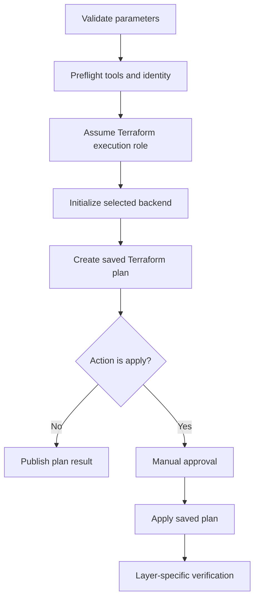
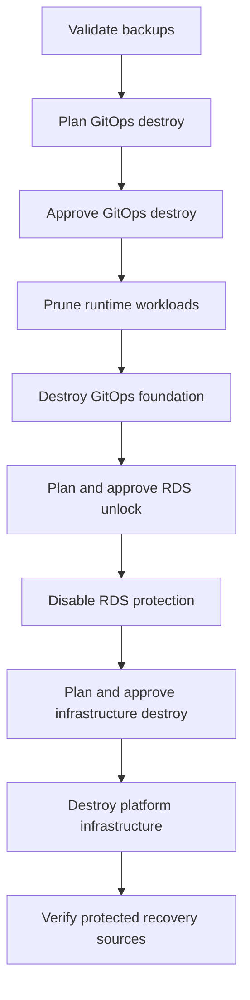

# Jenkins Orchestration

## Purpose

Jenkins is the controlled orchestration layer for Terraform lifecycle operations, platform bootstrap, teardown, and disaster recovery. Argo CD remains the continuous application-delivery engine.

This distinction prevents two automation systems from competing for ownership of the same runtime resources:

- **Terraform** manages AWS infrastructure and the GitOps control plane.
- **Jenkins** coordinates Terraform actions, approvals, and exceptional lifecycle procedures.
- **Argo CD** continuously reconciles Kubernetes applications from Git.
- **Engineers** retain read-only cluster access for inspection and troubleshooting.

## Responsibility boundary

| Activity | Primary owner | Reason |
|---|---|---|
| Terraform plan and apply | Jenkins | Centralized logs, credentials, and approval gates |
| AWS infrastructure state | Terraform | Declarative lifecycle and drift visibility |
| Argo CD installation | Terraform through Jenkins | Control-plane bootstrap dependency |
| Kubernetes application deployment | Argo CD | Pull-based reconciliation from Git |
| Application rollback | Git and Argo CD | Auditable revision-based rollback |
| GitOps pruning before teardown | Jenkins | Must occur before the cluster disappears |
| EFS inspection and data recovery | Jenkins | Exceptional privileged recovery workflow |
| Argo CD bootstrap credential publication | Jenkins | Short-lived secret extraction and secure publication |
| Routine cluster inspection | Engineer role | View-only EKS access policy |

Jenkins is not used for routine `kubectl apply` application delivery. Its direct Kubernetes operations are limited to platform lifecycle procedures that require the cluster to be manipulated before or outside normal Argo CD reconciliation.

## Pipeline inputs

The multibranch pipeline selects behavior using three primary parameters:

| Parameter | Typical values | Purpose |
|---|---|---|
| `TF_LAYER` | `platform-infra`, `platform-gitops`, `dns-account`, `artifact-registry`, `data-protection` | Selects the Terraform state and responsibility boundary |
| `TF_ACTION` | `plan`, `apply`, `destroy`, `inspect-efs`, `restore-efs-data` | Selects the lifecycle operation |
| `ENVIRONMENT` | `dev`, `stage`, `prod` | Selects environment-specific variables and state |

Destructive paths also require explicit confirmation parameters. The pipeline does not infer authorization for destruction from a generic apply request.

## Authentication model

### Jenkins execution identity

The Jenkins agent begins with its automation identity and assumes the Terraform execution role through AWS STS. Temporary credentials are loaded into the build environment and used for the selected pipeline stages.

The pipeline verifies identity before performing infrastructure work:

```bash
aws sts get-caller-identity
```

### Kubernetes authentication

For lifecycle operations, Jenkins generates or updates kubeconfig using the assumed execution role's AWS credentials. The execution role has an EKS access entry associated with the cluster-admin access policy.

This access supports:

- readiness validation;
- GitOps pruning before cluster destruction;
- EFS inspection and recovery pods;
- Argo CD bootstrap checks;
- secure retrieval and removal of the initial Argo CD credential.

The human Engineer role is associated with the cluster-wide view policy. It can inspect workloads but cannot create namespaces, persistent volumes, recovery pods, or secrets.

## Standard plan and apply flow



### Preflight

The pipeline checks Terraform, AWS CLI, and caller identity before assuming the execution role. Parameter guards reject unsupported layer, action, and environment combinations.

### Backend initialization

Each Terraform layer initializes against its own backend key. State separation reduces blast radius and prevents GitOps, infrastructure, DNS, or data-protection changes from sharing a single lifecycle.

### Saved plan

For an apply operation, Jenkins produces `apply.tfplan`. The exact reviewed plan is later applied rather than generating a new plan after approval.

### Manual approval

Jenkins pauses for explicit approval before applying infrastructure changes. The prompt includes the selected layer and environment.

### Verification

Layer-specific checks run after apply. Verification is based on operational outcomes—not only Terraform exit status.

## RDS rebuild selection

When `platform-infra` enables RDS creation, the pipeline runs `scripts/select-rds-restore-snapshot.sh`. The script selects an approved protected snapshot and passes it to Terraform as `rds_snapshot_id`.

The pipeline stops when no valid rebuild source exists. This prevents an infrastructure rebuild from silently creating an empty database.

The selected snapshot identifier is printed for auditability, while database credentials remain secret.

## Two-phase Argo CD bootstrap

The Argo CD root application uses a CRD installed by the Argo CD Helm release. The Kubernetes provider validates the manifest during planning, so the custom resource cannot be included in the first plan for a new cluster.

The pipeline solves this with two phases.

### Phase 1: GitOps foundation

If `applications.argoproj.io` is absent, Jenkins adds:

```text
-var=enable_argocd_root_app=false
```

The saved plan installs:

- the `argocd` namespace;
- the Argo CD Helm release and CRDs;
- the Argo CD ingress;
- foundation resources that do not require the `Application` CRD.

### Phase 2: Root application

After the foundation apply, Jenkins waits for the CRD:

```bash
kubectl wait \
  --for=condition=Established \
  customresourcedefinition/applications.argoproj.io \
  --timeout=10m
```

Jenkins then creates a second saved plan with `enable_argocd_root_app=true`, requests approval, and applies the repository secret and root application.

This produces deterministic first-cluster bootstrap while allowing later runs to converge normally when the CRD already exists.

## Secure Argo CD credential publication

After Argo CD becomes available, Jenkins:

1. creates temporary password, JSON, and kubeconfig files;
2. disables shell tracing around sensitive operations;
3. waits for the Argo CD server deployment;
4. reads the Kubernetes cluster UID;
5. checks whether AWS Secrets Manager already holds a credential for that cluster UID;
6. waits for `argocd-initial-admin-secret` when publication is required;
7. decodes the password into a permission-restricted temporary file;
8. publishes the structured credential to `argocd/admin` in AWS Secrets Manager;
9. deletes the initial Kubernetes secret;
10. removes all temporary files through an exit trap.

The password is never printed to the Jenkins console. If the current cluster UID already matches the stored document, Jenkins preserves the existing Secrets Manager version.

## Read-only EFS inspection

The `inspect-efs` action is restricted to the platform-infrastructure development workflow. It reads the EKS cluster name and EFS ID from Terraform outputs and invokes `scripts/inspect-restored-efs.sh` with Bash.

The script:

- creates an isolated inspection namespace;
- creates a temporary static EFS PV and PVC;
- mounts the restored filesystem read-only;
- displays a bounded directory tree for validation;
- removes the inspection namespace and persistent volume afterward.

This workflow discovered that AWS Backup placed recovered content beneath a timestamped directory containing the original PVC directory.

## EFS application-data recovery

The `restore-efs-data` action invokes `scripts/restore-efs-data.sh`. It is deliberately separate from an ordinary Terraform apply because it performs a data movement procedure rather than infrastructure reconciliation.

The workflow:

1. reads `eks_cluster_name` and `efs_id` from the platform state;
2. configures Kubernetes access with the execution role;
3. validates authorization for recovery resources;
4. creates or verifies namespace `clixx`;
5. creates or verifies dynamic PVC `clixx-wp-content-pvc`;
6. mounts the restored EFS filesystem using a temporary static source PV/PVC;
7. mounts the application PVC as the destination;
8. locates the nested AWS Backup recovery directory;
9. copies media while preserving expected ownership and permissions;
10. verifies markers, media, and recovered file count;
11. writes `.clixx-recovery-complete`;
12. removes the pod, temporary PVC, and temporary PV in dependency order.

The script is idempotent. When the completion marker exists, it verifies the destination and skips the copy.

## Controlled teardown flow



### GitOps pruning

Jenkins deletes or prunes Argo CD-managed runtime resources before the EKS cluster is removed. This gives Kubernetes controllers an opportunity to clean up ALBs and related cloud resources.

### RDS protection unlock

Database deletion protection is disabled through its own saved plan and approval. It is not embedded silently in the general destroy operation.

### Platform destruction

The infrastructure destroy proceeds only after the dependent runtime layer is removed and the database unlock is approved. The bootstrap backend and protected recovery artifacts remain intact.

### Post-destroy recovery verification

Jenkins reruns the RDS snapshot selection logic after destruction. The pipeline fails if it cannot identify the protected rebuild source.

## Cross-account DNS orchestration

The DNS-account layer manages the Route 53 role and trust relationship in the DNS account. Jenkins uses a dedicated cross-account execution role and external ID for that layer.

When the ExternalDNS source role was recreated, the target trust policy retained the deleted AWS principal identity. Running the DNS-account apply updated the policy in place. ExternalDNS subsequently reconciled the expected records.

This layer remains separate because DNS has a different account boundary, credential path, and blast radius from the EKS platform.

## Failure handling and cleanup

Shell stages use strict mode:

```bash
set -euo pipefail
```

Sensitive stages disable tracing with `set +x`. Temporary files and Kubernetes recovery resources use cleanup traps so failure paths receive the same cleanup attempt as successful paths.

The declarative `post` section removes saved plan files regardless of build outcome. Success and failure messages identify the selected layer, action, and environment.

Cleanup failures are handled carefully: temporary-resource cleanup should not conceal a successful data recovery, but it must remain visible in logs and be corrected before the workflow is considered operationally complete.

## Auditability

The pipeline records:

- the source Git revision;
- selected layer, action, and environment;
- AWS caller identity;
- backend initialization;
- Terraform plan summary;
- approval identity and timestamp;
- applied saved plan;
- selected RDS recovery snapshot;
- EFS restore and validation output;
- Kubernetes rollout and recovery results;
- DNS and endpoint verification results.

Secrets, private keys, decoded passwords, and database credentials are excluded from console output.

## Operational outcomes

The orchestration design successfully supported:

- full platform teardown and reconstruction;
- protected RDS snapshot recovery;
- AWS Backup EFS recovery and application-data migration;
- deterministic two-phase Argo CD bootstrap;
- secure bootstrap credential publication;
- pull-based restoration of runtime applications;
- cross-account DNS trust repair;
- end-to-end application and observability validation.

For the complete procedure, see the [teardown and rebuild runbook](../platform-infra/teardown-rebuild.md). For recorded results and screenshots, see the [disaster-recovery validation report](../disaster-recovery-validation.md).
