## Executive summary

On September 25, 2026, the Clixx GitOps platform completed a full teardown, data recovery, infrastructure rebuild, GitOps reconciliation, and end-to-end service validation in AWS.

The exercise recovered both persistent data domains:

- Amazon RDS was rebuilt from a protected encrypted snapshot.
- Amazon EFS was restored through AWS Backup, adopted into Terraform state, and used to repopulate the application PVC.

The rebuilt platform restored EKS, Argo CD, External Secrets, ExternalDNS, Prometheus, Grafana, the Clixx application, public DNS, and autoscaling. All three public endpoints were available after recovery.

## Validation scope

| Capability | Test performed | Result |
|---|---|---|
| Infrastructure teardown | Removed GitOps and platform layers in dependency order | Passed |
| Terraform state continuity | Preserved remote state and adopted restored EFS | Passed |
| Database recovery | Restored RDS from an encrypted protected snapshot | Passed |
| Filesystem recovery | Restored EFS from a completed AWS Backup recovery point | Passed |
| Kubernetes storage | Recreated mount targets and bound a dynamic RWX PVC | Passed |
| Application data | Recovered WordPress uploads and verified 92 files | Passed |
| EKS reconstruction | Recreated an active cluster and two worker nodes | Passed |
| GitOps bootstrap | Installed Argo CD and created the root application in two phases | Passed |
| Secret recovery | Reconciled the application database secret through External Secrets | Passed |
| Application reconciliation | Restored Clixx and platform applications from Git | Passed |
| Media maintenance | Completed the Argo CD PostSync verification Job | Passed |
| DNS recovery | Repaired cross-account trust and restored Route 53 records | Passed |
| Observability | Restored Prometheus and Grafana dashboards | Passed |
| Autoscaling | Verified HPA with two minimum and six maximum replicas | Passed |
| Public availability | Verified Clixx, Grafana, and Argo CD endpoints | Passed |

## Architecture recovery path

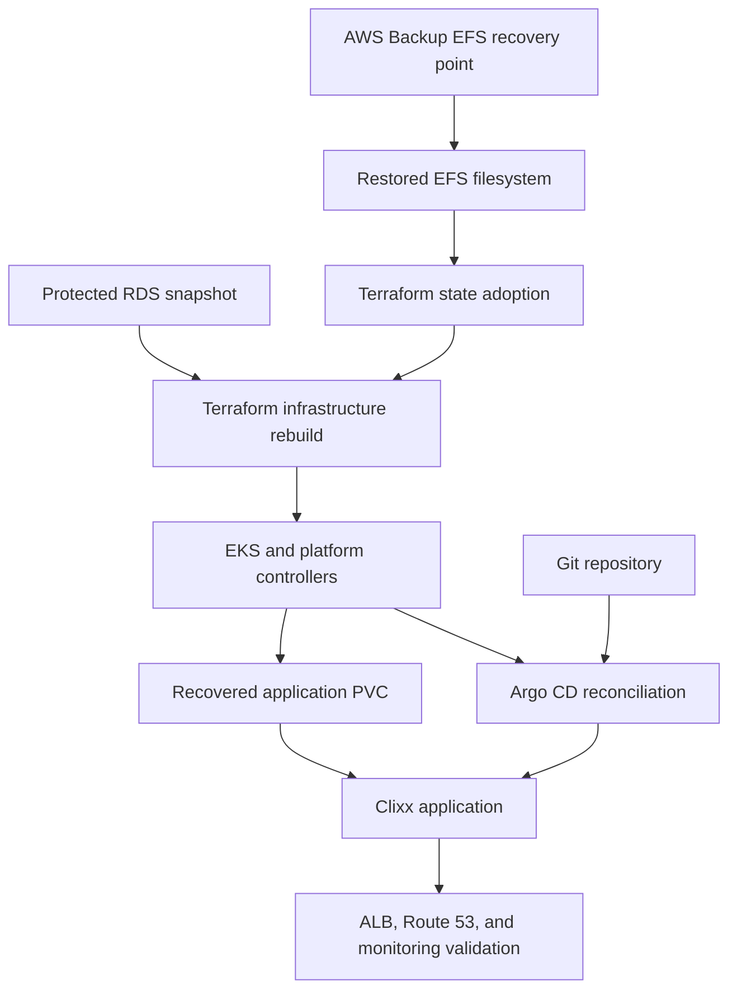

## Recovery evidence

### Infrastructure and persistent data

The rebuilt environment reached the following verified states:

- EKS cluster status: `ACTIVE`
- RDS status: `available`
- RDS encryption: enabled
- RDS deletion protection: enabled
- EFS status: `available`
- EFS encryption: enabled
- EFS mount targets: two
- Recovered EFS data size: approximately 3.3 MB
- Recovered application file count: 92
- Application PVC status: `Bound`
- Application PVC access mode: `RWX`
- Storage class: `efs-sc-clixx`

### GitOps recovery

Argo CD recovered the root application and child applications from the Git repository. The application resource tree showed the expected Kubernetes objects in a healthy, synchronized state.

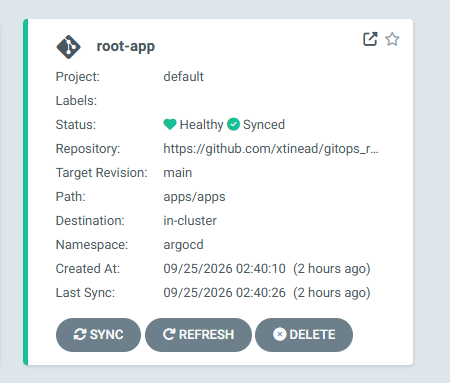

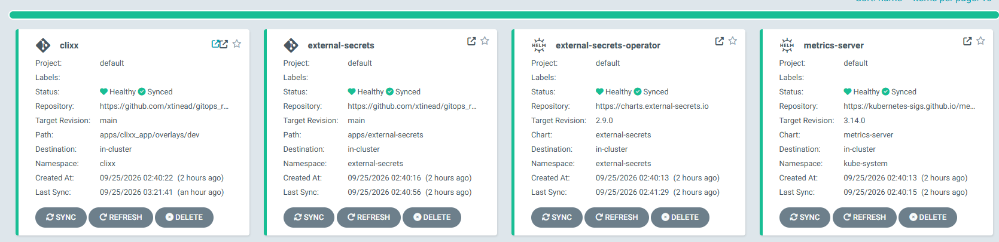

### Application recovery

The Clixx deployment successfully rolled out with two available replicas. The recovered WordPress media was mounted from the dynamic EFS PVC, and application flows were validated through the storefront.

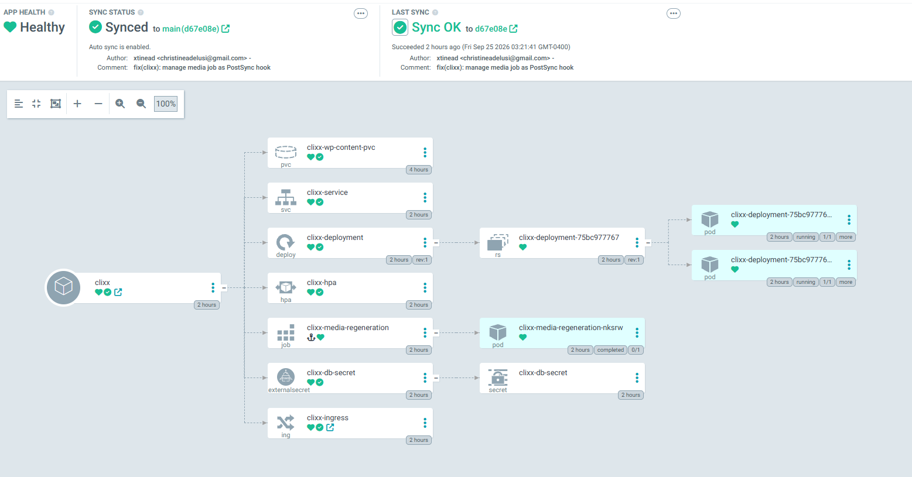

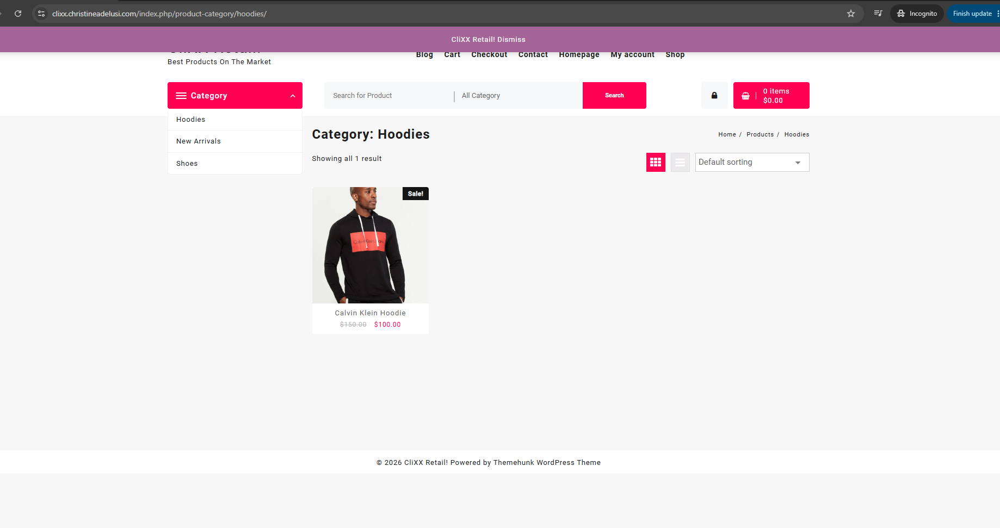

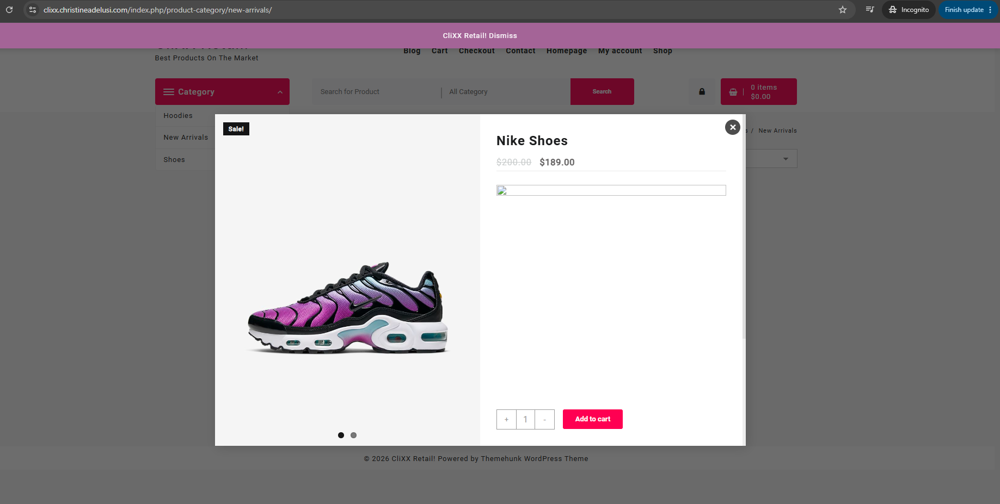

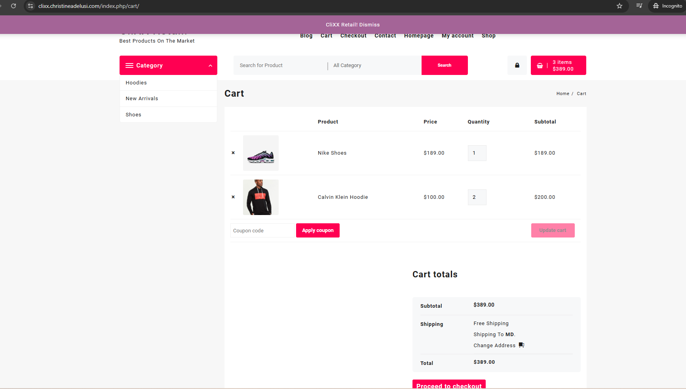

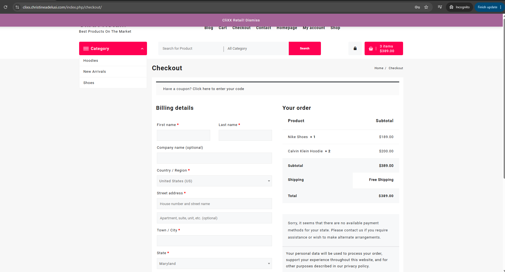

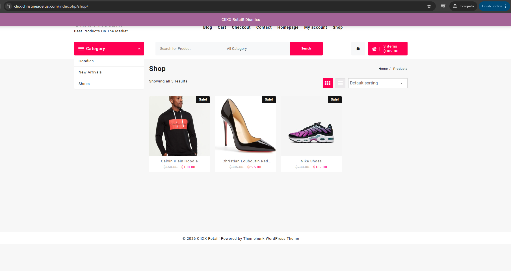

### Autoscaling and observability

The recovered environment restored its metrics pipeline and operational dashboards. The Clixx HPA reported a minimum of two replicas, a maximum of six, and two running replicas during validation.

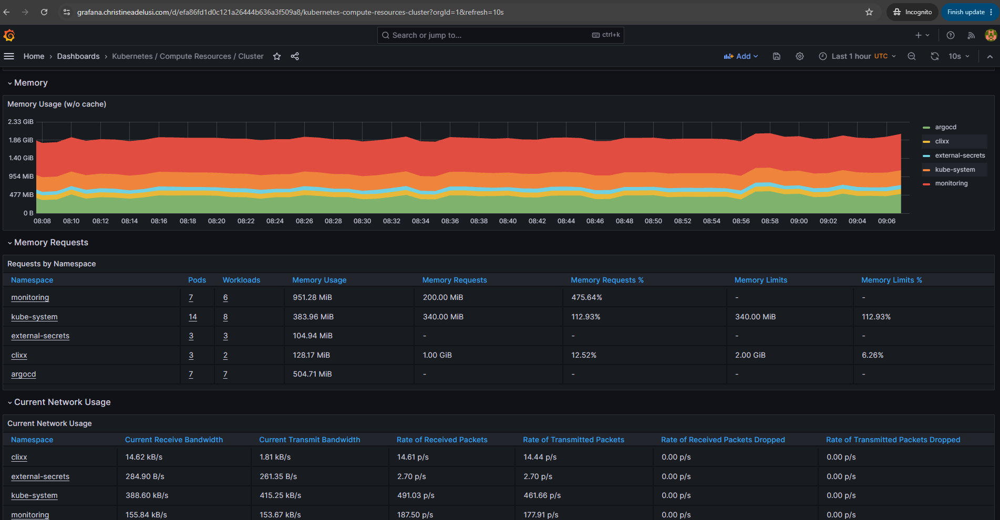

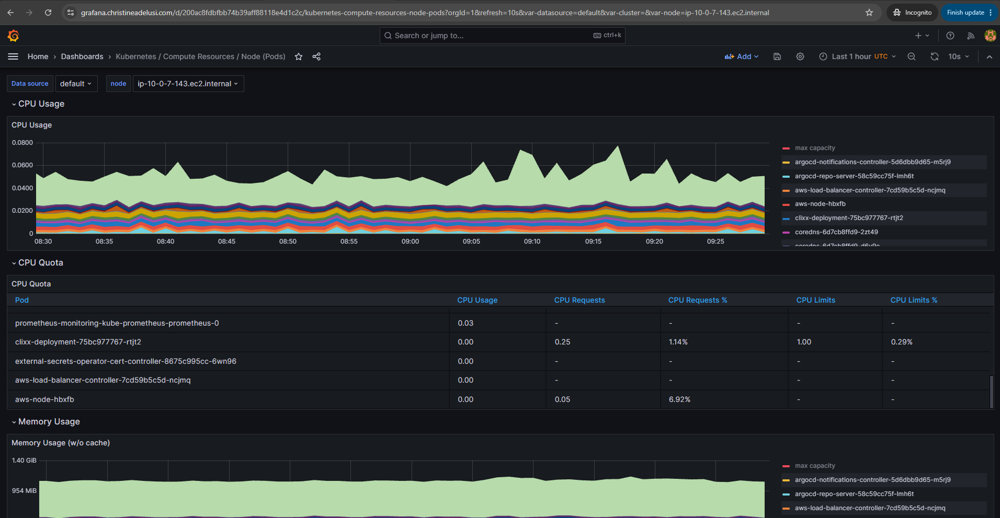

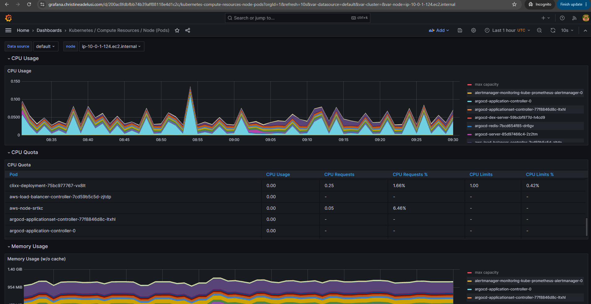

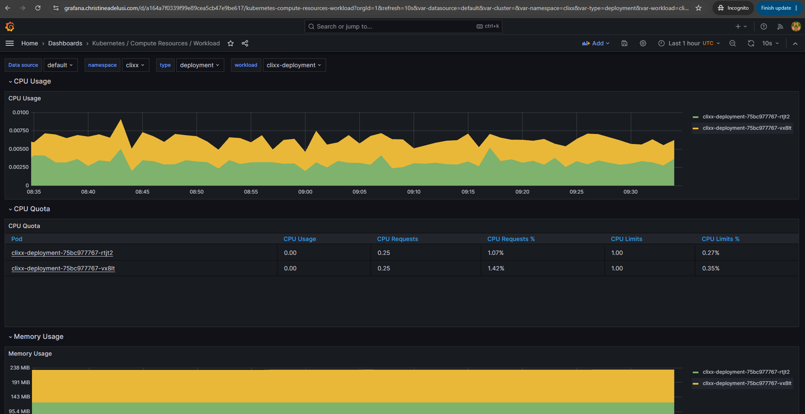

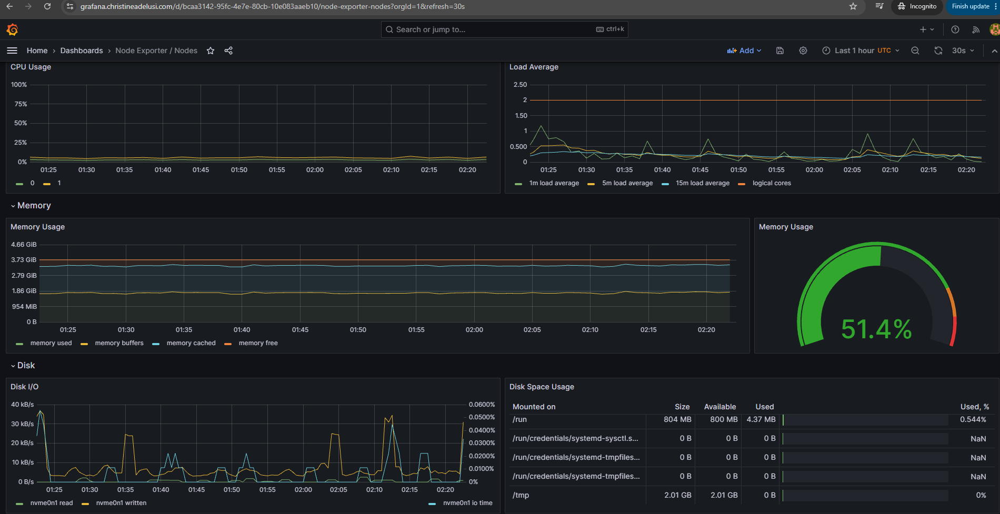

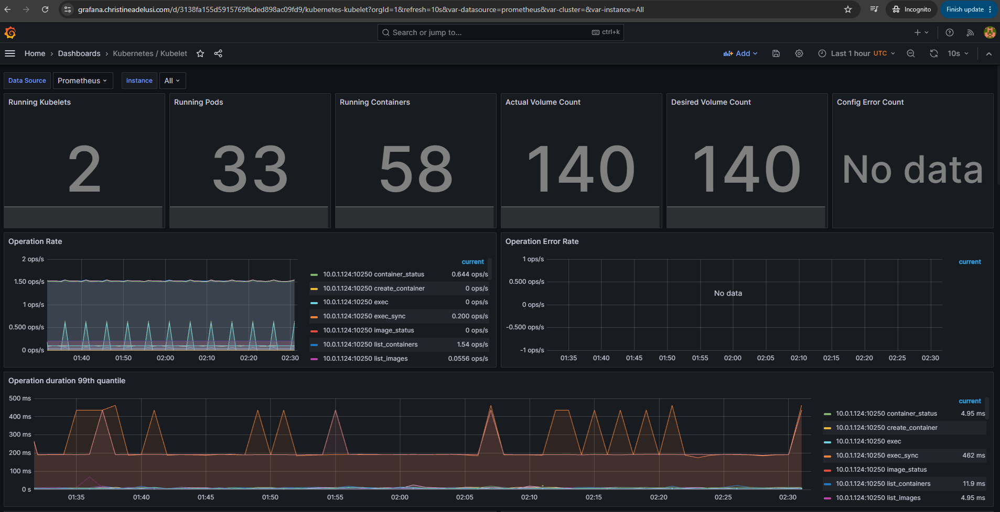

### Public endpoint validation

| Endpoint | Expected behavior | Result |
|---|---|---|
| `clixx.christineadelusi.com` | HTTPS storefront returns HTTP 200 | Passed |
| `grafana.christineadelusi.com` | HTTPS endpoint redirects to `/login` | Passed |
| `argocd.christineadelusi.com` | HTTPS Argo CD login is available | Passed |

## Failures discovered and corrective actions

The value of the exercise was not only that the final environment worked, but that it exposed real recovery dependencies.

### EFS encryption metadata was incomplete

**Observed failure:** The first AWS Backup restore job failed because `kmskeyid` was missing from the restore metadata.

**Correction:** The restore request was repeated with the intended KMS key ID.

**Permanent lesson:** Generate restore metadata from verified configuration and validate all encryption parameters before starting a restore job.

### Full Terraform configuration blocked EFS state adoption

**Observed failure:** Importing EFS through the full platform configuration failed because mount-target keys and Kubernetes and Helm provider values were unknown before apply.

**Correction:** A minimal Terraform configuration connected to the same backend was used to import the restored EFS resource.

**Permanent lesson:** Maintain a documented state-adoption procedure for restored resources whose primary configuration has apply-time dependencies.

### AWS Backup restored data into a nested directory

**Observed behavior:** The original PVC data appeared beneath an `aws-backup-restore_<timestamp>` directory instead of the EFS root.

**Correction:** A read-only inspection workflow identified the recovered PVC directory before the data-copy operation.

**Permanent lesson:** Discover and validate backup layout instead of assuming the restored mount root matches the original application path.

### Temporary recovery PVC delayed PV deletion

**Observed failure:** Cleanup waited on the temporary PV while its PVC still existed.

**Correction:** Cleanup order was changed to delete the temporary pod and PVC before the PV.

**Permanent lesson:** Kubernetes cleanup must follow ownership and binding dependencies.

### Argo CD custom resource was unavailable during planning

**Observed failure:** Terraform could not plan the root `Application` because the Argo CD CRD did not yet exist.

**Correction:** The pipeline was divided into a foundation apply followed by a CRD readiness check and a root-application apply.

**Permanent lesson:** CRD installation and custom-resource creation require explicit lifecycle separation when using Terraform Kubernetes manifests.

### Media Job lifecycle conflicted with GitOps reconciliation

**Observed behavior:** The immutable Kubernetes Job was absent or difficult to recreate as an ordinary continuously managed resource.

**Correction:** It was converted to an Argo CD `PostSync` hook with `BeforeHookCreation`.

**Permanent lesson:** One-time operational Jobs should use hook semantics instead of ordinary desired-state lifecycle semantics.

### Cross-account DNS trust retained a stale principal identity

**Observed failure:** ExternalDNS received STS `AccessDenied` after its source IAM role was recreated.

**Correction:** The DNS-account Terraform layer rewrote the target role trust policy with the recreated role ARN. ExternalDNS then updated 12 records successfully.

**Permanent lesson:** Recreating an IAM role can invalidate resource-based trust in another account even when the role name is unchanged.

### Local DNS retained negative cache entries

**Observed behavior:** Public resolvers returned the restored records before the local resolver did.

**Correction:** Resolution was verified against Cloudflare and Google DNS while local cache expiration completed.

**Permanent lesson:** Validate authoritative or public resolution independently before diagnosing a successfully reconciled DNS record as missing.

## Security controls validated

- Terraform execution used an assumed execution role.
- The human Engineer role retained view-only EKS access.
- Privileged recovery operations ran through controlled Jenkins workflows.
- Terraform apply and destroy operations required explicit approval.
- RDS deletion protection required a separate unlock workflow.
- RDS and EFS remained encrypted.
- The Argo CD bootstrap password was published to AWS Secrets Manager without appearing in logs.
- The initial Kubernetes admin secret was removed after secure publication.
- GitOps repository credentials and database credentials were not committed to source control.
- Public documentation uses placeholders for account, filesystem, and KMS identifiers.

## Recovery assessment

The exercise passed its functional recovery criteria. Infrastructure state, database state, filesystem data, Kubernetes workloads, GitOps reconciliation, DNS, monitoring, autoscaling, and user-facing behavior were all restored.

The exercise also showed that successful cloud-resource creation is not sufficient evidence of recovery. A complete validation must include:

1. protected data restoration;
2. Terraform ownership and state convergence;
3. Kubernetes storage binding;
4. GitOps synchronization;
5. secret availability;
6. application-level workflows;
7. public DNS and ingress;
8. monitoring and autoscaling.

## Recommended follow-up actions

1. Add automated preflight validation for EFS restore metadata and KMS configuration.
2. Package the minimal EFS adoption configuration as a controlled recovery utility.
3. Record timestamps for future exercises to calculate measured RTO and RPO.
4. Add automated endpoint and recovered-file checks to the final Jenkins verification stage.
5. Add an automated DNS-account trust refresh or validation after source IAM role recreation.
6. Run the recovery exercise on a scheduled cadence and record deviations.
7. Keep the detailed operational steps in the [teardown and rebuild runbook](platform-infra/teardown-rebuild.md).
