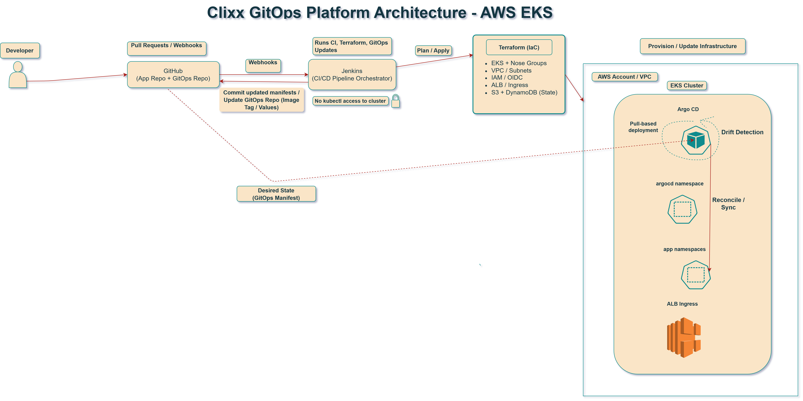
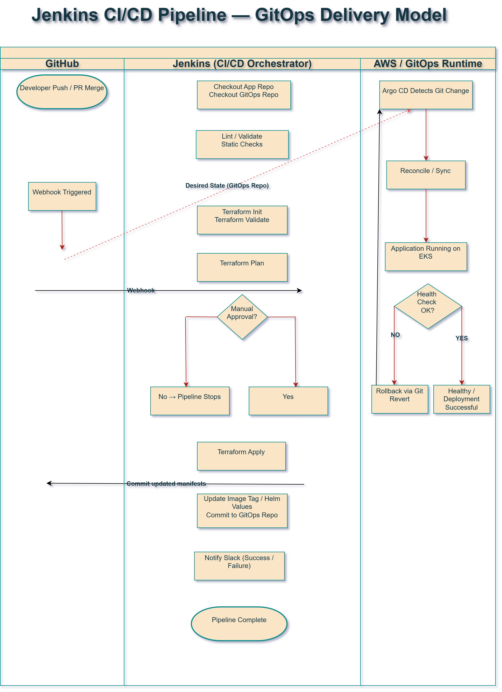

# Clixx GitOps Platform Engineering Platform

This repository documents the design, evolution, and operation of a **production-style AWS + Kubernetes GitOps platform**.

The platform demonstrates how modern platform engineering practices can be used to build **secure, reproducible infrastructure and controlled application delivery** using:

- **Terraform** for infrastructure provisioning
- **Jenkins** for CI orchestration
- **Argo CD** for GitOps reconciliation
- **Kubernetes (EKS)** for runtime orchestration

The goal of this platform is to demonstrate how **Infrastructure as Code, CI/CD governance, and GitOps delivery** can work together to produce a **safe, auditable, and repeatable cloud platform.**

---

# Platform At a Glance

**Cloud Platform**

AWS (VPC, EKS, IAM, ALB, EFS, RDS)

**Infrastructure as Code**

Terraform modular architecture with remote state isolation

**CI/CD**

Jenkins pipeline orchestration with approval gates

**GitOps**

Argo CD pull-based deployment model

**Containers**

Kubernetes (Amazon EKS)

**Key Focus Areas**

- Infrastructure safety and blast radius control
- Terraform state protection
- CI isolation from production clusters
- Git-based delivery governance
- Safe infrastructure rebuild and teardown

---

---

# Architecture Diagrams

The following diagrams illustrate the core architecture and delivery model of the platform.

These visuals provide a high-level overview of how infrastructure provisioning, CI/CD orchestration, and GitOps reconciliation work together.

---

## Platform Architecture Overview

This diagram shows the high-level platform architecture, including:

- AWS infrastructure components
- Amazon EKS cluster
- Terraform infrastructure provisioning
- Jenkins CI orchestration
- Argo CD GitOps reconciliation
- Application delivery flow

---

## Jenkins CI/CD GitOps Delivery Model

This diagram illustrates the CI/CD delivery pipeline and how GitOps controls runtime deployments.

Key characteristics include:

- Jenkins pipeline orchestration
- Terraform validation and apply workflow
- GitOps repository updates
- Argo CD pull-based reconciliation
- Secure separation between CI and Kubernetes clusters

---

# Documentation Map

Detailed platform documentation is available below.

## Platform Design

- [Platform Infrastructure Architecture](platform-infra/architecture.md)

- [GitOps Delivery Model](platform-gitops/gitops-flow.md)

- [CI/CD Orchestration](ci-cd/jenkins-orchestration.md)

## Engineering Decisions

- [Pipeline Design Decisions](ci-cd/pipeline-design-decisions.md)

- [Security Model](platform-infra/security-model.md)

- [Teardown & Rebuild Strategy](platform-infra/teardown-rebuild.md)

## Platform Evolution

- [Platform Evolution](platform-evolution.md)

- [Lessons Learned](lessons-learned.md)

- [Platform Case Study](case-study.md)

---

# Architecture Decision Records (ADR)

Key architectural decisions made during the development of this platform are documented below.

- [ADR-0001: Use GitOps for Runtime Delivery](adr/0001-use-gitops-for-runtime-delivery.md)

- [ADR-0002: Isolate Terraform State into a Bootstrap Layer](adr/0002-isolate-terraform-state-bootstrap.md)

- [ADR-0003: Prevent Jenkins from Deploying Directly to Kubernetes](adr/0003-prevent-jenkins-direct-cluster-access.md)

- [ADR-0004: Require Manual Approval Before Terraform Apply](adr/0004-require-manual-approval-before-terraform-apply.md)

---

# Platform Architecture

The platform architecture intentionally separates responsibilities across infrastructure provisioning, CI orchestration, and runtime reconciliation.

This separation allows infrastructure governance to remain controlled while still enabling automated application delivery.

## Platform Architecture Layers

The platform is composed of **three intentional layers**.

### 1. Bootstrap Layer (Permanent)

Provides foundational services that should never be destroyed.

Includes:

- Terraform backend (S3 + DynamoDB)
- State locking and protection
- Shared infrastructure prerequisites

This layer guarantees that platform rebuilds remain safe.

---

### 2. Platform Infrastructure Layer

Responsible for provisioning AWS primitives using Terraform.

Components include:

- VPC and networking
- Amazon EKS cluster
- IAM roles and policies
- RDS and EFS where required
- ALB ingress infrastructure

Infrastructure changes are governed through **CI approval gates**.

---

### 3. Platform GitOps Layer

Responsible for application delivery.

Managed through:

- Argo CD
- GitOps manifests
- Environment overlays

All runtime changes originate from Git.

There are **no direct kubectl deployments from CI pipelines**.

---

# CI/CD Delivery Flow

The CI/CD pipeline orchestrates infrastructure changes and GitOps updates **without granting Jenkins direct cluster access**.

### Delivery Flow

1. Terraform changes are proposed and reviewed
2. CI pipeline validates infrastructure changes
3. Manual approval gate is required before apply
4. Jenkins updates GitOps manifests
5. Argo CD reconciles the cluster state
6. Rollbacks occur via Git revert

This model ensures **secure separation between CI systems and production clusters.**

---

# Real Engineering Challenges Solved

During the development of this platform, several real-world infrastructure and delivery challenges were encountered and addressed.

---

## Terraform State Safety

One of the early risks identified was accidental deletion of Terraform state infrastructure during platform teardown.

To mitigate this risk, the platform introduced a **Bootstrap Layer** responsible for:

- Terraform state storage (S3)
- State locking (DynamoDB)

This layer is **permanent** and prevents destructive operations from impacting Terraform state integrity.

---

## Infrastructure Rebuild Reliability

Infrastructure teardown and rebuild scenarios were tested to ensure platform resilience.

The architecture was refactored to guarantee:

- Safe destruction of platform infrastructure
- Reprovisioning without manual intervention
- No dependency conflicts during rebuild

This allows the platform to be recreated **entirely from Terraform code**.

---

## Eliminating Direct Cluster Access from CI

A common anti-pattern in CI/CD pipelines is granting CI systems direct `kubectl` access to production clusters.

To improve security, this platform enforces strict separation:

- Jenkins orchestrates infrastructure and Git updates
- Argo CD performs runtime reconciliation
- Jenkins never interacts directly with the Kubernetes API

This significantly reduces the **blast radius of CI credentials**.

---

## GitOps Drift Detection

Runtime drift is addressed using Argo CD reconciliation.

If cluster state diverges from Git:

- Argo CD detects the drift
- The cluster is automatically reconciled
- Unauthorized changes are reverted

Git remains the **single source of truth**.

---

# Platform Engineering Skills Demonstrated

This project demonstrates practical experience across several key areas of modern platform engineering.

## Infrastructure as Code

- Terraform modular architecture
- Environment-aware infrastructure design
- Remote state management (S3 + DynamoDB)
- Infrastructure lifecycle management
- Safe infrastructure teardown and rebuild

## Kubernetes & GitOps

- Amazon EKS cluster architecture
- Argo CD pull-based deployment model
- GitOps repository structure and overlays
- Drift detection and reconciliation
- Declarative Kubernetes configuration

## CI/CD Engineering

- Jenkins pipeline orchestration
- Infrastructure validation and planning
- Manual approval gates for governance
- GitOps repository updates from CI
- Pipeline observability via notifications

## Cloud Architecture

- AWS VPC and networking design
- Secure IAM role and policy management
- OIDC integration for Kubernetes workloads
- Load balancing and ingress architecture

## Platform Security

- CI isolation from cluster credentials
- Least privilege IAM design
- Git-based audit trail for deployments
- Approval gates for infrastructure changes

## Operational Reliability

- Platform rebuild testing
- Drift detection and reconciliation
- Version-controlled rollback strategy
- Infrastructure blast-radius control

---

# Why This Platform Exists

This repository demonstrates **real-world DevOps and platform engineering practices**, including:

- Infrastructure modularization
- GitOps-based deployment
- CI/CD governance controls
- Cloud-native architecture
- Secure runtime delivery patterns

The goal is to demonstrate how infrastructure, CI/CD, and GitOps can work together to produce a **safe and repeatable platform engineering workflow.**

---

# Author

**Christine Adelusi**

Senior DevOps / Platform Engineer

AWS • Terraform • Kubernetes • GitOps • CI/CD
