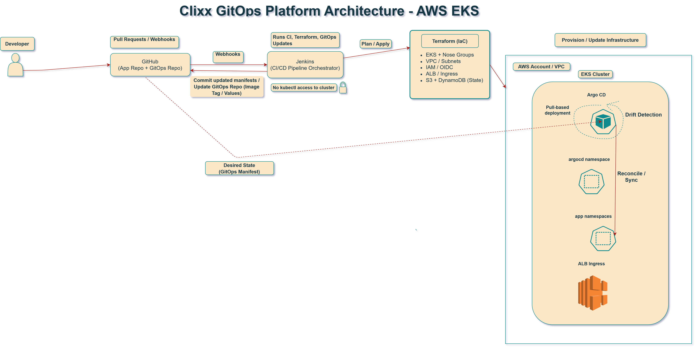
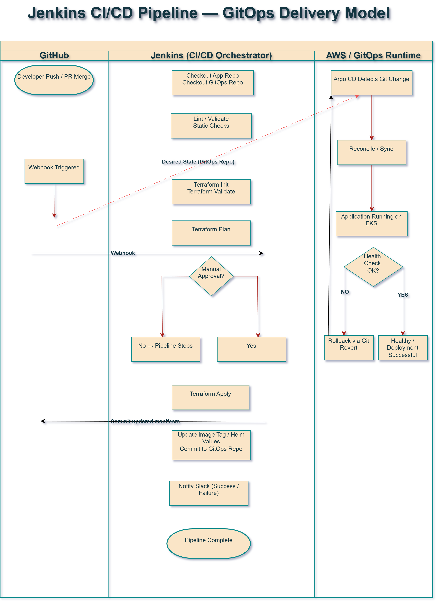
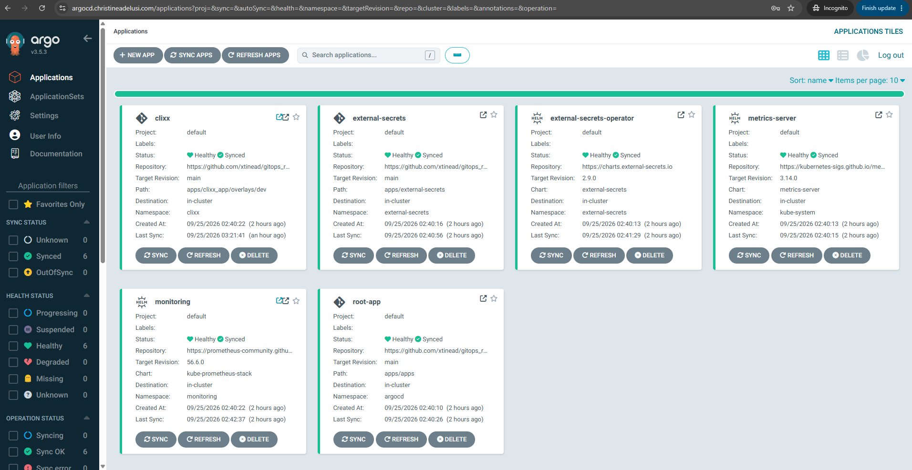
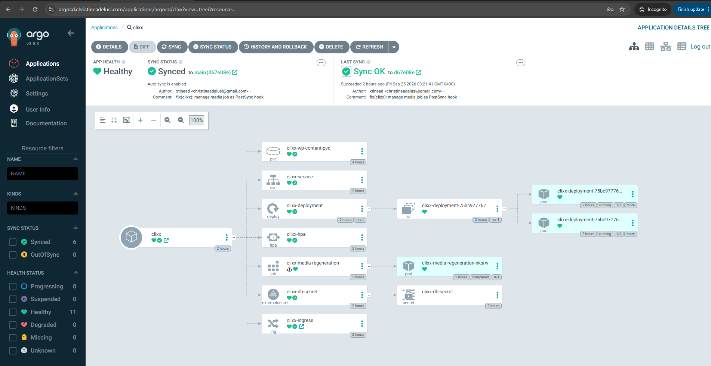
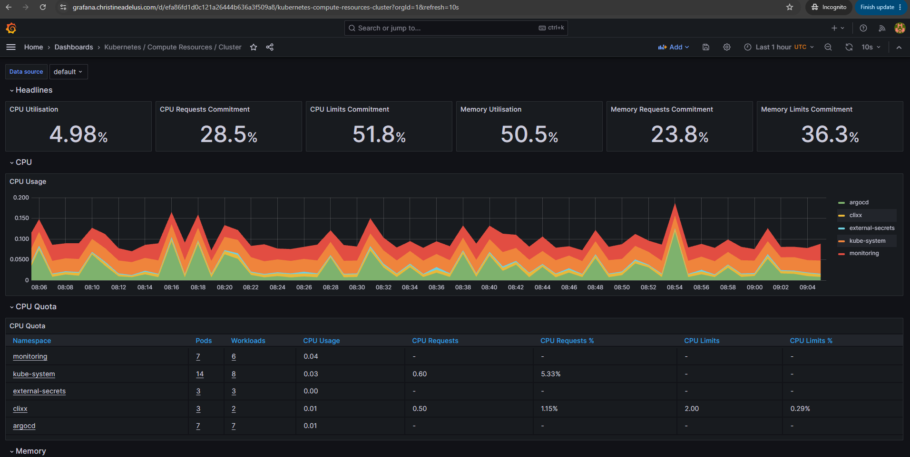
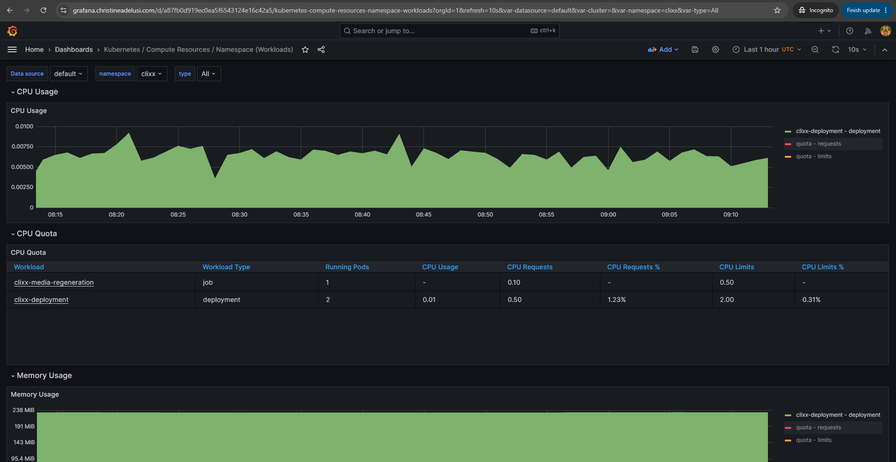
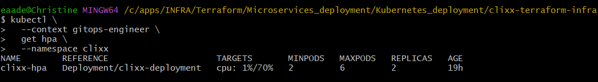
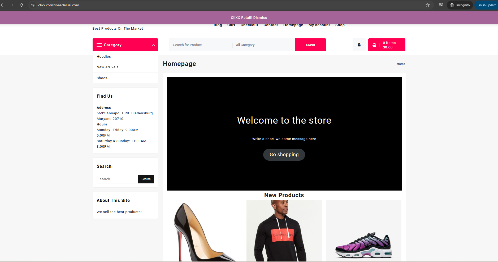

# Clixx GitOps Platform Engineering Portfolio

This repository documents the design, evolution, operation, and tested recovery of a **production-style AWS and Kubernetes GitOps platform**.

The platform demonstrates how modern platform-engineering practices combine:

- **Terraform** for infrastructure provisioning and state management
- **Jenkins** for CI orchestration, approvals, lifecycle operations, and controlled recovery
- **Argo CD** for pull-based Kubernetes application reconciliation
- **Amazon EKS** for runtime orchestration
- **Amazon RDS and Amazon EFS** for persistent application data
- **AWS Backup** for filesystem recovery
- **Prometheus and Grafana** for metrics and operational visibility
- **External Secrets and ExternalDNS** for secure application configuration and DNS automation

The goal is to demonstrate how Infrastructure as Code, CI/CD governance, GitOps delivery, least-privilege access, observability, and disaster recovery work together to produce a **safe, auditable, and repeatable cloud platform**.

---

# Platform at a Glance

| Capability | Implementation |
|---|---|
| Cloud platform | AWS VPC, EKS, IAM, ALB, EFS, RDS, AWS Backup, KMS, Route 53, and Secrets Manager |
| Infrastructure as Code | Terraform modules with isolated remote state |
| CI/CD | Jenkins orchestration with saved plans and approval gates |
| GitOps | Argo CD app-of-apps and pull-based reconciliation |
| Containers | Kubernetes on Amazon EKS |
| Persistent data | Encrypted RDS snapshots and AWS Backup-protected EFS |
| Secrets | External Secrets and AWS Secrets Manager |
| Observability | Prometheus, Grafana, Metrics Server, and HPA |
| Public routing | AWS Load Balancer Controller and cross-account ExternalDNS |
| Recovery | Tested teardown, rebuild, state adoption, data migration, and endpoint validation |

## Key focus areas

- Infrastructure safety and blast-radius control
- Terraform state protection and restored-resource adoption
- Clear Jenkins, Terraform, and Argo CD ownership boundaries
- Git-based delivery governance and drift correction
- Least-privilege human access
- Protected database and filesystem recovery
- Safe infrastructure teardown and reconstruction
- Application-level recovery validation
- Cluster, node, workload, and autoscaling visibility

---

# Architecture Diagrams

The diagrams below show how infrastructure provisioning, CI/CD orchestration, GitOps reconciliation, and application delivery work together.

## Platform Architecture Overview

This diagram presents the high-level platform architecture, including:

- AWS networking and infrastructure components
- Amazon EKS
- Terraform provisioning boundaries
- Jenkins orchestration
- Argo CD reconciliation
- Persistent RDS and EFS data
- Application ingress and DNS
- Monitoring and autoscaling

## Jenkins CI/CD and GitOps Delivery Model

This diagram illustrates the delivery pipeline and the separation between infrastructure orchestration and runtime reconciliation:

- Jenkins validates and plans Terraform changes.
- Manual approval gates protect apply and destroy operations.
- Terraform manages infrastructure and the GitOps control plane.
- Argo CD pulls declared runtime state from Git.
- Jenkins uses controlled cluster access only for documented bootstrap, teardown, recovery, and verification procedures.
- Routine application deployment remains owned by Argo CD.

---

# Start Here

| Document | What it demonstrates |
|---|---|
| [Platform case study](case-study.md) | Problem, architecture, design decisions, recovery challenge, and outcomes |
| [Disaster-recovery validation](disaster-recovery-validation.md) | Test scope, evidence, failures, corrective actions, and final results |
| [Teardown and rebuild runbook](platform-infra/teardown-rebuild.md) | Repeatable destruction and full-recovery procedure |
| [Jenkins orchestration](ci-cd/jenkins-orchestration.md) | CI/CD ownership, approvals, bootstrap, teardown, and recovery automation |
| [Lessons learned](lessons-learned.md) | Concrete engineering lessons discovered during the recovery exercise |

---

# Documentation Map

## Platform design

- [Platform infrastructure architecture](platform-infra/architecture.md)
- [GitOps delivery model](platform-gitops/gitops-flow.md)
- [Argo CD deployments](platform-gitops/argo-deployments.md)
- [CI/CD orchestration](ci-cd/jenkins-orchestration.md)

## Engineering and security decisions

- [Pipeline design decisions](ci-cd/pipeline-design-decisions.md)
- [Security model](platform-infra/security-model.md)
- [Teardown and rebuild runbook](platform-infra/teardown-rebuild.md)
- [Disaster-recovery validation](disaster-recovery-validation.md)

## Platform evolution

- [Platform evolution](platform-evolution.md)
- [Lessons learned](lessons-learned.md)
- [Platform case study](case-study.md)

---

# Architecture Decision Records

Key decisions made during the design and recovery of the platform are recorded below.

| ADR | Status | Decision |
|---|---|---|
| [ADR-0001](adr/0001-use-gitops-for-runtime-delivery.md) | Accepted | Use GitOps for runtime delivery |
| [ADR-0002](adr/0002-isolate-terraform-state-bootstrap.md) | Accepted | Isolate Terraform state into a permanent bootstrap layer |
| [ADR-0003](adr/0003-prevent-jenkins-direct-cluster-access.md) | Superseded | Prevent Jenkins from performing routine application deployment |
| [ADR-0004](adr/0004-require-manual-approval-before-terraform-apply.md) | Accepted | Require manual approval before Terraform apply |
| [ADR-0005](adr/0005-allow-controlled-jenkins-cluster-lifecycle-access.md) | Accepted | Allow controlled Jenkins cluster lifecycle and recovery access |

ADR-0005 refines ADR-0003 without weakening the GitOps model. Jenkins does not perform routine application deployment. Argo CD remains the runtime delivery authority, while Jenkins may perform narrowly defined and auditable bootstrap, teardown, recovery, and verification operations.

---

# Platform Architecture

The platform intentionally separates infrastructure provisioning, lifecycle orchestration, and runtime reconciliation. This keeps governance controlled while enabling automated delivery and recovery.

## Platform architecture layers

### 1. Bootstrap layer — permanent

The bootstrap layer provides foundational services that are preserved across platform teardown and rebuild:

- Terraform state storage in Amazon S3
- State locking
- State-protection controls
- Shared backend prerequisites

Preserving this layer ensures that state history and coordination remain available during reconstruction.

### 2. Platform infrastructure layer

Terraform provisions and manages:

- VPC and multi-AZ networking
- Amazon EKS and worker nodes
- IAM roles, policies, OIDC, and EKS access entries
- Amazon RDS
- Amazon EFS and mount targets
- EFS CSI integration and storage classes
- AWS Load Balancer Controller
- ExternalDNS identity
- Backup and encryption integrations

Infrastructure changes pass through Jenkins validation, saved plans, and approval gates.

### 3. Platform GitOps layer

The GitOps layer provides:

- Argo CD
- Root app-of-apps application
- Git repository credentials
- Environment-specific manifests and overlays
- Clixx application resources
- External Secrets
- Metrics Server
- Prometheus and Grafana

Long-lived runtime changes originate in Git and are reconciled by Argo CD.

### Supporting account boundaries

Cross-account DNS access is managed through a separate Terraform state and execution path. This isolates Route 53 permissions and trust-policy changes from the EKS platform lifecycle.

---

# CI/CD and GitOps Delivery Flow

## Routine delivery flow

1. Infrastructure or application configuration changes are proposed in Git.
2. Jenkins validates Terraform changes and creates a saved plan when infrastructure is affected.
3. A manual approval gate is required before Terraform apply.
4. Terraform updates infrastructure or the GitOps control plane.
5. Argo CD detects runtime changes in the GitOps repository.
6. Argo CD reconciles the Kubernetes cluster.
7. Drift is detected and corrected against the declared Git state.
8. Application rollback occurs through Git history and Argo CD reconciliation.

## Controlled lifecycle access

Jenkins uses the Kubernetes API only for explicitly defined operations that cannot be delegated safely to Argo CD:

- readiness and CRD checks;
- workload pruning before cluster destruction;
- read-only inspection of restored EFS content;
- temporary EFS recovery resources and data migration;
- two-phase Argo CD bootstrap;
- secure publication and removal of the initial Argo CD credential;
- post-recovery verification.

The human Engineer role remains view-only. Privileged mutations occur through version-controlled, logged automation using temporary assumed-role credentials.

---

# Disaster-Recovery Validation

On September 25, 2026, the platform completed a full teardown, persistent-data restoration, infrastructure rebuild, GitOps bootstrap, DNS recovery, and end-to-end validation.

## Validated recovery outcomes

| Area | Result |
|---|---|
| Amazon EKS | Recreated and active with two healthy worker nodes |
| Amazon RDS | Restored from an encrypted protected snapshot |
| Amazon EFS | Restored through AWS Backup and adopted into Terraform state |
| Application storage | Dynamic RWX PVC bound through `efs-sc-clixx` |
| Recovered media | 92 application files verified |
| Clixx deployment | Two available replicas and successful rollout |
| HPA | Minimum 2, maximum 6, current 2 during validation |
| Argo CD | Root and child applications synchronized and healthy |
| External Secrets | Database secret reconciled without committing credentials to Git |
| Media maintenance | PostSync verification Job completed successfully |
| ExternalDNS | Cross-account trust repaired and 12 Route 53 records reconciled |
| Public endpoints | Clixx, Grafana, and Argo CD available through HTTPS |

## Recovery sequence

1. Validate RDS and EFS recovery sources.
2. Prune GitOps-managed workloads.
3. Destroy the GitOps layer.
4. Unlock RDS protection through a separate approved plan.
5. Destroy platform infrastructure while preserving bootstrap state and backups.
6. Restore EFS through AWS Backup.
7. Adopt the restored filesystem into Terraform state.
8. Rebuild EKS, RDS, EFS mount targets, IAM, and controllers.
9. Copy restored WordPress media into the new application PVC.
10. Bootstrap Argo CD in two phases.
11. Reconcile applications and secrets from Git.
12. Repair cross-account Route 53 trust.
13. Validate DNS, ingress, application behavior, metrics, and autoscaling.

See the [detailed recovery evidence](disaster-recovery-validation.md) and [operational runbook](platform-infra/teardown-rebuild.md).

---

# Recovery and Operational Evidence

## Argo CD application health

## Kubernetes observability

## Autoscaling and recovered application

---

# Real Engineering Challenges Solved

## Terraform state safety

The platform separates permanent bootstrap state from replaceable platform layers. This prevents an infrastructure teardown from destroying the backend needed to coordinate reconstruction.

## Restored-resource state adoption

AWS Backup restored EFS outside Terraform. A minimal adoption configuration attached the restored filesystem to the existing state before the main infrastructure plan ran, preventing creation of an empty replacement.

## RDS and EFS recovery

RDS was rebuilt from a protected encrypted snapshot. EFS required an AWS Backup restore job, KMS metadata, Terraform adoption, mount-target recreation, filesystem inspection, and controlled data migration into a dynamic PVC.

## Argo CD CRD bootstrap

Terraform could not plan the root `Application` before the Argo CD CRD existed. The pipeline was divided into foundation and root-application phases with an explicit CRD readiness check.

## Idempotent application-data recovery

The recovery script writes a completion marker and verifies existing data on rerun. Interrupted or repeated pipeline executions do not duplicate the copy operation.

## Cross-account IAM trust repair

Recreating the ExternalDNS IAM role changed its AWS principal identity. Reapplying the DNS-account layer replaced the stale principal in the Route 53 role trust policy and restored DNS reconciliation.

## Secure bootstrap credential lifecycle

The Argo CD initial administrator password is published to AWS Secrets Manager without appearing in logs. The initial Kubernetes secret is removed after successful publication.

## GitOps drift detection

Argo CD continuously compares cluster state with Git. Unauthorized or accidental runtime drift is visible and can be automatically reconciled.

---

# Platform Engineering Skills Demonstrated

## Infrastructure as Code

- Terraform modular architecture
- Environment-aware configuration
- S3 remote-state management and locking
- Isolated state by lifecycle and account boundary
- Restored-resource import and adoption
- Safe teardown and rebuild

## Kubernetes and GitOps

- Amazon EKS architecture
- EKS access entries and IAM integration
- Argo CD app-of-apps delivery
- GitOps overlays and reconciliation
- CRD-aware staged bootstrap
- EFS CSI dynamic and static provisioning
- PostSync operational hooks
- Drift detection and Git-based rollback

## CI/CD engineering

- Jenkins multibranch orchestration
- Terraform validation and saved plans
- Manual approval gates
- Explicit destructive-action controls
- Temporary STS credentials
- Secure secret publication
- Idempotent recovery scripts
- Dependency-aware cleanup

## Cloud architecture

- Multi-AZ AWS networking
- IAM roles, OIDC, and least-privilege access
- Encrypted RDS and EFS
- AWS Backup recovery
- ALB ingress architecture
- Cross-account Route 53 automation
- AWS Secrets Manager integration

## Observability and scaling

- Prometheus metrics collection
- Grafana cluster and workload dashboards
- Metrics Server
- Kubernetes HPA
- Node, pod, namespace, and workload validation

## Operational reliability

- Full teardown and rebuild testing
- RDS snapshot recovery
- EFS backup restoration and migration
- Application-level recovery validation
- Public DNS and endpoint verification
- Documented failure modes and abort conditions

---

# Why This Platform Exists

This repository demonstrates platform engineering as an operational discipline—not only a collection of provisioning scripts.

It shows how to:

- define clear ownership across Terraform, Jenkins, and Argo CD;
- protect infrastructure state and persistent application data;
- make privileged actions explicit and auditable;
- recover infrastructure without losing Terraform ownership;
- restore runtime state from Git;
- validate recovery through application behavior and monitoring;
- convert failures into automation, ADRs, and reusable runbooks.

The platform demonstrates a **safe, recoverable, observable, and repeatable delivery model** suitable for Senior DevOps and Platform Engineering discussions.

---

# Author

**Christine Adelusi**

Senior DevOps / Platform Engineer

AWS · Terraform · Kubernetes · Jenkins · Argo CD · GitOps · CI/CD · Prometheus · Grafana
