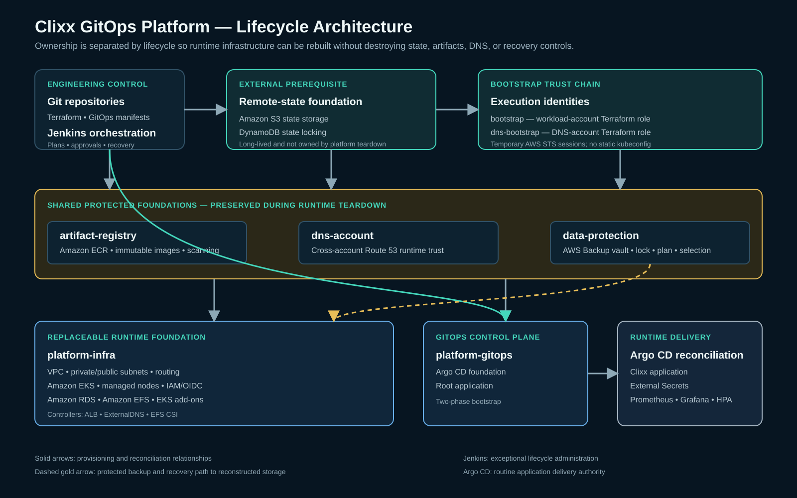
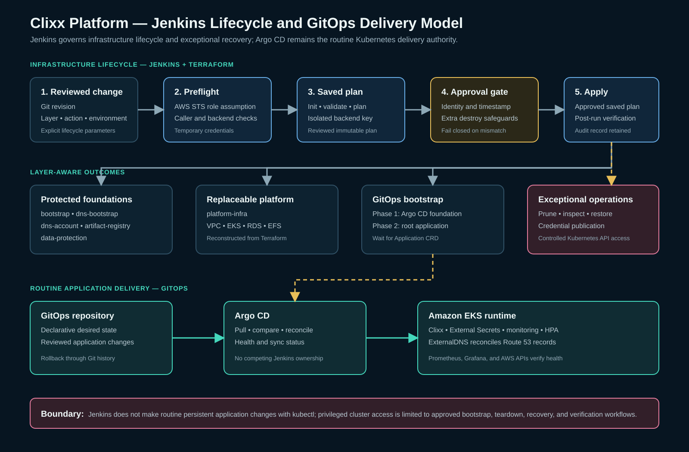

# Clixx GitOps Platform

This repository documents the design, evolution, operation, and tested recovery of a production-style AWS and Kubernetes GitOps platform.

The platform demonstrates how modern platform-engineering practices combine:

- **Terraform** for isolated infrastructure and lifecycle domains;
- **Jenkins** for CI orchestration, reviewed plans, approvals, teardown, and controlled recovery;
- **Argo CD** for pull-based Kubernetes application reconciliation;
- **Amazon EKS** for runtime orchestration;
- **Amazon RDS and Amazon EFS** for persistent application data;
- **AWS Backup** for protected EFS recovery points;
- **Amazon ECR** for immutable rebuild-critical application images;
- **Prometheus and Grafana** for operational visibility;
- **External Secrets and AWS Secrets Manager** for runtime secret delivery;
- **ExternalDNS and Route 53** for cross-account DNS reconciliation.

The goal is to demonstrate how Infrastructure as Code, CI/CD governance, GitOps delivery, least-privilege access, observability, lifecycle isolation, and disaster recovery work together to produce a safe, auditable, and repeatable cloud platform.

---

## Platform at a Glance

| Capability | Implementation |
|---|---|
| Cloud platform | AWS VPC, EKS, IAM, ALB, EFS, RDS, AWS Backup, Route 53, ECR, and Secrets Manager |
| Infrastructure as Code | Isolated Terraform roots with separate remote-state keys |
| CI/CD | Jenkins orchestration with saved plans, approval gates, and layer-specific verification |
| GitOps | Argo CD app-of-apps and pull-based reconciliation |
| Containers | Kubernetes on Amazon EKS with immutable images in Amazon ECR |
| Persistent data | Encrypted RDS snapshots and AWS Backup-protected EFS |
| Secrets | External Secrets and AWS Secrets Manager |
| Observability | Prometheus, Grafana, Metrics Server, and HPA |
| Public routing | AWS Load Balancer Controller and cross-account ExternalDNS |
| Recovery | Tested teardown, rebuild, state adoption, data migration, and endpoint validation |

### Key focus areas

- Infrastructure safety and blast-radius control
- Explicit ownership and lifecycle boundaries
- Terraform state isolation and restored-resource adoption
- Shared foundations that survive runtime replacement
- Jenkins, Terraform, and Argo CD responsibility boundaries
- Git-based delivery governance and drift correction
- Least-privilege human and automation access
- Protected database and filesystem recovery
- Safe infrastructure teardown and reconstruction
- Application-level recovery validation
- Cluster, workload, and autoscaling visibility

---

## Architecture Diagrams

The diagrams show how infrastructure provisioning, CI/CD orchestration, GitOps reconciliation, and application delivery work together.

### Platform Architecture Overview

The platform architecture includes:

- externally established remote-state prerequisites;
- workload and DNS execution-identity bootstrap;
- shared DNS, artifact-registry, and data-protection foundations;
- environment-specific VPC, EKS, RDS, and EFS infrastructure;
- Jenkins lifecycle orchestration;
- Argo CD reconciliation;
- persistent-data recovery;
- application ingress, DNS, monitoring, and autoscaling.

> The diagram assets are being refreshed to reflect the expanded lifecycle model. The written architecture documents are the current source of truth.

### Jenkins CI/CD and GitOps Delivery Model

The delivery model preserves the following boundary:

- Jenkins validates and plans Terraform changes.
- Manual approval gates protect apply and destroy operations.
- Terraform manages AWS infrastructure and the GitOps control plane.
- Argo CD pulls declared runtime state from Git.
- Jenkins uses controlled cluster access only for documented bootstrap, teardown, recovery, and verification procedures.
- Routine application deployment remains owned by Argo CD.

---

## Lifecycle Architecture

The platform is divided into distinct responsibility domains.

| Domain | Owner | Lifecycle treatment |
|---|---|---|
| Remote-state foundation | External prerequisite | Permanent |
| Workload identity bootstrap | Terraform `bootstrap` root | Foundational administrative procedure |
| DNS identity bootstrap | Terraform `dns-bootstrap` root | Foundational administrative procedure |
| Cross-account DNS | Terraform `dns-account` root | Shared; destruction blocked |
| Artifact registry | Terraform `artifact-registry` root | Shared; destruction blocked |
| Runtime infrastructure | Terraform `platform-infra` root | Environment-specific and replaceable |
| Data protection | Terraform `data-protection` root | Shared; destruction blocked |
| GitOps control plane | Terraform `platform-gitops` root | Environment-specific and replaceable |
| Runtime applications | Argo CD and Git | Continuously reconciled |
| Recovery operations | Jenkins and versioned scripts | Executed when required |

This model allows EKS and its dependent runtime resources to be rebuilt without deleting the state, image, DNS, and backup foundations needed for recovery.

Read the complete [Terraform lifecycle architecture](../terraform/README.md) and [platform infrastructure architecture](platform-infra/architecture.md).

---

## Delivery and Control Boundaries

| System | Primary responsibility |
|---|---|
| Terraform | AWS infrastructure, protected shared foundations, and the Argo CD control plane |
| Jenkins | Validation, saved plans, approvals, orchestration, teardown, recovery, and verification |
| Argo CD | Routine Kubernetes application delivery and continuous reconciliation |
| Git | Desired runtime state, review history, and rollback source |
| Engineers | Review, approval, read-only inspection, and controlled administrative bootstrap |

Jenkins does not perform routine application delivery with `kubectl`. Direct Kubernetes operations are limited to lifecycle procedures that cannot safely be delegated to Argo CD, including readiness checks, pre-destroy pruning, EFS recovery, two-phase Argo CD bootstrap, and post-recovery verification.

---

## Disaster-Recovery Validation

On September 25, 2026, the platform completed a full teardown, persistent-data restoration, infrastructure rebuild, GitOps bootstrap, DNS recovery, and end-to-end validation.

### Validated outcomes

| Area | Result |
|---|---|
| Amazon EKS | Recreated and active with two healthy worker nodes |
| Amazon RDS | Restored from an encrypted protected snapshot |
| Amazon EFS | Restored through AWS Backup and adopted into Terraform state |
| Application storage | Dynamic RWX PVC bound through the EFS storage class |
| Recovered media | 92 application files verified |
| Clixx deployment | Two available replicas and successful rollout |
| HPA | Minimum 2, maximum 6, current 2 during validation |
| Argo CD | Root and child applications synchronized and healthy |
| External Secrets | Database secret reconciled without committing credentials to Git |
| Media maintenance | PostSync verification job completed successfully |
| ExternalDNS | Cross-account trust repaired and expected Route 53 records reconciled |
| Public endpoints | Clixx, Grafana, and Argo CD available through HTTPS |

### Recovery sequence

1. Validate RDS and EFS recovery sources.
2. Prune GitOps-managed workloads.
3. Destroy the GitOps control plane.
4. Unlock RDS protection through a separately approved plan.
5. Destroy runtime infrastructure while preserving shared foundations.
6. Restore EFS through AWS Backup.
7. Adopt the restored filesystem into Terraform state.
8. Rebuild EKS, RDS, EFS integrations, IAM, and controllers.
9. Copy restored application media into the application PVC.
10. Bootstrap Argo CD in two phases.
11. Reconcile applications and secrets from Git.
12. Validate cross-account DNS trust.
13. Verify ingress, application behavior, data, metrics, and autoscaling.

See the [detailed recovery evidence](disaster-recovery-validation.md) and [operational runbook](platform-infra/teardown-rebuild.md).

---

## Start Here

| Document | What it demonstrates |
|---|---|
| [Platform case study](case-study.md) | Problem, architecture, design decisions, recovery challenge, and outcomes |
| [Platform architecture](platform-infra/architecture.md) | Accounts, lifecycle roots, ownership boundaries, dependencies, and security controls |
| [Terraform lifecycle architecture](../terraform/README.md) | State isolation, construction order, protected roots, and recovery relationships |
| [Disaster-recovery validation](disaster-recovery-validation.md) | Test scope, evidence, failures, corrective actions, and final results |
| [Teardown and rebuild runbook](platform-infra/teardown-rebuild.md) | Repeatable destruction and full-recovery procedure |
| [Jenkins orchestration](ci-cd/jenkins-orchestration.md) | CI/CD ownership, approvals, bootstrap, teardown, and recovery automation |
| [Lessons learned](lessons-learned.md) | Engineering lessons discovered during the recovery exercise |

---

## Documentation Map

### Platform design

- [Platform infrastructure architecture](platform-infra/architecture.md)
- [Terraform lifecycle architecture](../terraform/README.md)
- [GitOps delivery model](platform-gitops/gitops-flow.md)
- [Argo CD deployments](platform-gitops/argo-deployments.md)
- [CI/CD orchestration](ci-cd/jenkins-orchestration.md)

### Engineering and security decisions

- [Pipeline design decisions](ci-cd/pipeline-design-decisions.md)
- [Security model](platform-infra/security-model.md)
- [Teardown and rebuild runbook](platform-infra/teardown-rebuild.md)
- [Disaster-recovery validation](disaster-recovery-validation.md)

### Platform evolution

- [Platform evolution](platform-evolution.md)
- [Lessons learned](lessons-learned.md)
- [Platform case study](case-study.md)

---

## Architecture Decision Records

| ADR | Status | Decision |
|---|---|---|
| [ADR-0001](adr/0001-use-gitops-for-runtime-delivery.md) | Accepted | Use GitOps for routine runtime delivery |
| [ADR-0002](adr/0002-isolate-terraform-state-bootstrap.md) | Superseded by ADR-0006 | Original state-isolation bootstrap model |
| [ADR-0003](adr/0003-prevent-jenkins-direct-cluster-access.md) | Superseded by ADR-0005 | Original strict Jenkins cluster-access restriction |
| [ADR-0004](adr/0004-require-manual-approval-before-terraform-apply.md) | Accepted | Require approval before Terraform apply |
| [ADR-0005](adr/0005-allow-controlled-jenkins-cluster-lifecycle-access.md) | Accepted | Allow controlled Jenkins lifecycle and recovery access |
| [ADR-0006](adr/0006-separate-state-foundation-from-execution-identity.md) | Accepted | Separate external remote state from execution-identity bootstrap |

ADR-0005 preserves Argo CD as the routine runtime delivery authority while allowing Jenkins to perform narrowly defined lifecycle operations.

ADR-0006 preserves the original state-isolation objective while correcting ownership: the backend is an external prerequisite, and the bootstrap roots establish execution identities.

---

## Recovery and Operational Evidence

### Argo CD application health

### Kubernetes observability

### Autoscaling and recovered application

---

# Author

**Christine Adelusi**

Senior DevOps / Platform Engineer

AWS · Terraform · Kubernetes · Jenkins · Argo CD · GitOps · CI/CD · Prometheus · Grafana
