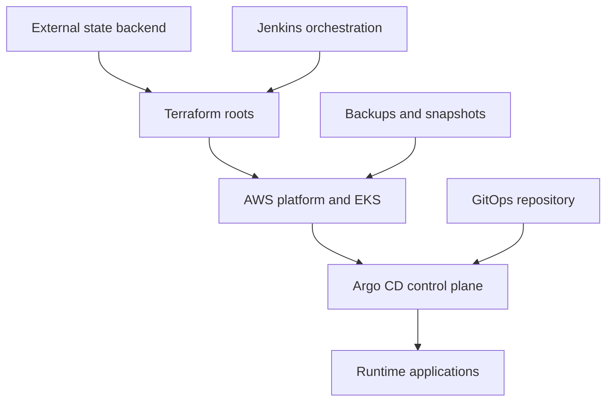

# Platform Infrastructure Architecture

The Clixx GitOps Platform is an AWS Kubernetes environment designed around lifecycle isolation, controlled automation, pull-based application delivery, and tested recovery.

The architecture separates permanent prerequisites, shared protective services, replaceable environment infrastructure, the GitOps control plane, and continuously reconciled applications. This prevents a routine cluster rebuild from also deleting the resources needed to recover it.

## Architecture Objectives

- Rebuild runtime infrastructure without losing state, images, DNS authorization, or backup controls.
- Separate AWS infrastructure ownership from Kubernetes application ownership.
- Limit direct Kubernetes mutation outside Argo CD.
- Require reviewed Terraform plans and explicit approval.
- Restore RDS and EFS data through independent recovery paths.
- Support cross-account DNS without granting broad hosted-zone access to the workload account.
- Make teardown and recovery repeatable through version-controlled automation.

## Lifecycle Domains

| Domain | Terraform root or owner | Primary responsibility | Lifecycle |
|---|---|---|---|
| Remote-state foundation | External prerequisite | S3 backend and DynamoDB state locking | Permanent |
| Workload identity bootstrap | `bootstrap` | Terraform execution role and scoped IAM-management permissions | Foundational |
| DNS identity bootstrap | `dns-bootstrap` | DNS-account Terraform execution role and narrow IAM-management permissions | Foundational |
| Cross-account DNS | `dns-account` | Route 53 runtime role and ExternalDNS policy | Shared; destroy blocked |
| Artifact registry | `artifact-registry` | ECR repository, immutable images, scanning, policy, and retention | Shared; destroy blocked |
| Runtime infrastructure | `platform-infra` | Networking, EKS, RDS, EFS, IAM/OIDC, add-ons, controllers, and storage | Environment-specific; replaceable |
| Data protection | `data-protection` | AWS Backup vault, vault lock, plan, retention, and EFS selection | Shared; destroy blocked |
| GitOps control plane | `platform-gitops` | Argo CD, ingress, repository credential, and root application | Environment-specific; replaceable |
| Runtime applications | Argo CD and Git | Clixx, monitoring, External Secrets, and application resources | Continuously reconciled |
| Recovery operations | Jenkins and versioned scripts | RDS selection, EFS inspection, data migration, and validation | On demand |

## High-Level System Flow



Jenkins orchestrates Terraform and exceptional lifecycle operations. Argo CD remains the authority for routine Kubernetes application delivery.

## Account Boundaries

The design uses separate workload and DNS account responsibilities.

### Workload account

The workload account contains:

- the Terraform execution role;
- ECR;
- VPC and EKS;
- RDS and EFS;
- AWS Backup controls;
- workload IAM and OIDC integrations;
- the Argo CD control plane;
- application and monitoring workloads.

### DNS account

The DNS account contains:

- the public Route 53 hosted zone;
- the DNS Terraform execution role;
- the cross-account Route 53 runtime role;
- the policy used by ExternalDNS.

The DNS trust path is intentionally separate from workload infrastructure because it has a different credential path, account boundary, and blast radius.

## Remote-State Model

The S3 backend and DynamoDB lock table are external, long-lived prerequisites. The current implementation consumes them but does not provision them.

Terraform state is isolated by root and environment. Representative sanitized keys are:

```text
bootstrap/<environment>.tfstate
dns-bootstrap/<environment>.tfstate
dns-account/<environment>.tfstate
artifact-registry/<environment>.tfstate
platform-infra/<environment>.tfstate
data-protection/<environment>.tfstate
platform-gitops/<environment>.tfstate
```

State separation prevents a GitOps, DNS, registry, backup, or runtime-infrastructure change from sharing one lifecycle transaction.

## Bootstrap Trust Chain

The two bootstrap roots establish execution identities rather than runtime services.

1. A controlled administrative identity applies `bootstrap` in the workload account.
2. `bootstrap` creates the role used by Jenkins for workload-account Terraform operations.
3. A controlled DNS-account procedure applies `dns-bootstrap`.
4. `dns-bootstrap` creates the DNS Terraform execution role with narrow IAM-management permissions.
5. Jenkins later uses the established trust path to manage `dns-account`.

These roots are not ordinary Jenkins selections because the pipeline depends on the roles they create.

## Shared Protected Foundations

### Artifact registry

The artifact-registry root keeps ECR independent from EKS. It manages:

- the Clixx image repository;
- immutable image tags;
- repository access policy;
- lifecycle controls;
- image-scanning expectations.

Registry destruction is blocked so a cluster rebuild does not remove the image needed to restore service.

### Cross-account DNS

The dns-account root manages the role and policy ExternalDNS assumes in the DNS account. Its destruction is blocked during ordinary platform operations.

### Data protection

The data-protection root manages:

- the AWS Backup service role;
- a dedicated backup vault;
- governance-mode vault lock;
- a daily EFS backup plan;
- bounded recovery-point retention;
- tag-based EFS resource selection.

Tag-based selection decouples backup governance from volatile platform outputs. A matching EFS filesystem becomes protected when it carries the required backup tag.

## Platform Infrastructure

The platform-infra root owns the environment-specific runtime foundation.

### Networking

- VPC;
- public and private subnets across availability zones;
- internet gateway;
- NAT gateways and elastic IP addresses;
- route tables and associations;
- security groups and scoped database/storage access.

### Amazon EKS

- EKS control plane;
- managed node group;
- access entries and view-only engineer association;
- OIDC provider;
- VPC CNI, CoreDNS, kube-proxy, and EFS CSI add-ons;
- workload IAM roles.

### Controllers and integrations

- AWS Load Balancer Controller;
- ExternalDNS and its workload identity;
- External Secrets workload identity;
- EFS CSI permissions;
- Kubernetes EFS storage class.

### Persistent services

- encrypted Amazon RDS;
- database subnet group and security rules;
- encrypted Amazon EFS;
- EFS mount targets.

RDS and EFS are provisioned within the runtime root, but their recovery sources and restoration procedures are protected independently.

## GitOps Control Plane

The platform-gitops root depends directly on platform-infra remote-state outputs for:

- EKS cluster name;
- API endpoint;
- certificate authority data.

It manages:

- the Argo CD namespace;
- Argo CD Helm release and CRDs;
- Argo CD ingress;
- Git repository credential;
- root app-of-apps application.

The control plane is replaceable. Desired application state remains in Git.

## Two-Phase Argo CD Bootstrap

The Argo CD root application uses the `Application` custom resource. On a new cluster, that CRD does not exist when Terraform first plans the GitOps root.

The pipeline resolves the dependency in two phases:

1. apply the namespace, Helm release, CRDs, ingress, and supporting resources with the root application disabled;
2. wait for the CRD, create a second saved plan, request approval, and apply the repository credential and root application.

This makes first-cluster bootstrap deterministic while preserving normal convergence on later runs.

## CI/CD Responsibility Boundary

| Activity | Owner |
|---|---|
| Terraform validation, planning, approval, and apply | Jenkins |
| AWS infrastructure lifecycle | Terraform |
| Argo CD installation and root bootstrap | Terraform through Jenkins |
| Routine Kubernetes application deployment | Argo CD |
| Runtime rollback | Git revert and Argo CD reconciliation |
| Pre-destroy workload pruning | Jenkins |
| EFS inspection and data migration | Jenkins recovery scripts |
| Routine engineer access | Read-only EKS access |

Jenkins does not perform routine application deployment with `kubectl`. Its Kubernetes mutations are limited to documented bootstrap, teardown, recovery, and verification operations that must run before Argo CD exists or while it is being removed.

## Application and Observability Layer

Argo CD reconciles the declared runtime state from the GitOps repository, including:

- Clixx application workloads and services;
- ingress resources;
- External Secrets resources;
- monitoring components;
- Prometheus and Grafana;
- Metrics Server;
- Horizontal Pod Autoscalers;
- application storage claims and validation hooks.

Git provides the audit trail and rollback history. Argo CD detects and corrects runtime drift.

## Persistent-Data Strategy

Database and filesystem recovery use different mechanisms.

### Amazon RDS

- deletion protection guards the running database;
- destruction requires a separate unlock plan and approval;
- rebuild automation selects an approved encrypted snapshot;
- the pipeline fails closed when no valid recovery source exists.

### Amazon EFS

- AWS Backup creates recovery points in the protected vault;
- restore creates an encrypted replacement filesystem;
- the restored filesystem is adopted into Terraform state;
- a temporary read-only inspection workflow locates restored content;
- a versioned recovery script copies application media into the dynamic application PVC;
- a completion marker makes the copy operation safely repeatable.

## Controlled Teardown

The platform is removed in dependency order:

1. validate RDS and EFS recovery sources;
2. create and approve the GitOps destroy plan;
3. prune Argo CD-managed applications while the cluster and cloud controllers remain available;
4. destroy platform-gitops;
5. create and approve a separate RDS protection-unlock plan;
6. confirm infrastructure and RDS destruction;
7. destroy platform-infra;
8. preserve state, ECR, DNS foundations, backup controls, and recovery points;
9. verify protected sources after destruction.

## Tested Recovery Sequence

1. Restore EFS through AWS Backup.
2. Adopt the restored filesystem into platform-infra state.
3. Select an approved encrypted RDS snapshot.
4. rebuild networking, EKS, RDS, EFS integrations, IAM, add-ons, and controllers.
5. Inspect the restored EFS hierarchy.
6. Copy recovered application data into the application PVC.
7. Bootstrap Argo CD in two phases.
8. Reconcile applications and secrets from Git.
9. Validate or repair cross-account DNS trust.
10. Verify HTTPS endpoints, application data, metrics, and autoscaling.

The full procedure was validated through a complete teardown and recovery exercise.

## Security Boundaries

- Jenkins uses temporary AWS STS credentials.
- Engineers receive view-only cluster access for routine inspection.
- Workloads use IAM roles associated through EKS OIDC.
- Application secrets are retrieved from AWS Secrets Manager rather than stored in Git.
- Cross-account DNS permissions are narrowly scoped.
- Saved plans and manual approvals protect apply and destroy operations.
- Shared registry, DNS, and data-protection destruction is blocked.
- Sensitive shell stages disable tracing and clean temporary files.
- Public documentation excludes account IDs, role ARNs, credentials, and backend names.

## Key Outputs

The platform-infra root exposes the minimum context required by downstream automation, including:

- VPC and subnet identifiers;
- EFS filesystem identifier;
- EKS cluster name and endpoint;
- EKS certificate authority data;
- OIDC provider information;
- node and security-group identifiers;
- RDS endpoint.

The platform-gitops root consumes only the cluster context required to configure Kubernetes and Helm providers.

## Related Documentation

- [Terraform lifecycle architecture](../../terraform/README.md)
- [Jenkins orchestration](../ci-cd/jenkins-orchestration.md)
- [GitOps flow](../platform-gitops/gitops-flow.md)
- [Security model](security-model.md)
- [Teardown and rebuild runbook](teardown-rebuild.md)
- [Disaster-recovery validation](../disaster-recovery-validation.md)
- [Platform case study](../case-study.md)
