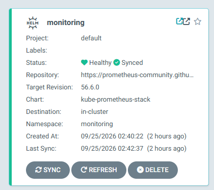

This runbook documents the tested teardown, disaster-recovery, and rebuild procedure for the Clixx GitOps platform. It is based on a full recovery exercise completed on September 25, 2026, rather than a theoretical design.

## Purpose

The procedure demonstrates that the platform can be removed and rebuilt while preserving application data and restoring the operating model:

- Terraform recreates AWS and Kubernetes platform resources.
- Amazon RDS is rebuilt from a protected encrypted snapshot.
- Amazon EFS is restored from AWS Backup and adopted into Terraform state.
- Recovered WordPress media is copied into the dynamically provisioned application volume.
- Argo CD restores applications from Git.
- External Secrets restores application credentials.
- ExternalDNS restores public DNS records through a cross-account Route 53 role.
- Prometheus, Grafana, and the Kubernetes HPA confirm operational health.

## Scope and ownership

| Layer | Owner | Responsibilities |
|---|---|---|
| Bootstrap | Terraform | Remote state bucket and locking configuration |
| Platform infrastructure | Terraform | VPC, EKS, IAM, RDS, EFS, storage classes, and controllers |
| GitOps foundation | Terraform and Helm | Argo CD namespace, release, ingress, repository secret, and root application |
| Runtime applications | Argo CD | Clixx, monitoring, metrics-server, and External Secrets resources |
| Recovery orchestration | Jenkins | Approval gates and controlled lifecycle/recovery operations |
| Application data | RDS, EFS, AWS Backup | Database and WordPress media durability |

Jenkins does not own routine application delivery. Argo CD performs continuous pull-based reconciliation. Jenkins receives controlled privileged access only for infrastructure bootstrap, teardown pruning, recovery operations, and secure credential publication. The human Engineer role remains read-only.

## Recovery objectives

This exercise validates recoverability and operational correctness. Formal production RTO and RPO targets should be defined from business requirements and tested on a recurring schedule.

The recovery point used in this validation contained:

- an encrypted RDS snapshot selected by the rebuild automation;
- an AWS Backup EFS recovery point in `COMPLETED` state;
- approximately 3.3 MB of restored EFS content and 92 recovered files;
- WordPress upload data and recovery markers.

## Safety rules

1. Never destroy the bootstrap state layer as part of an application-platform teardown.
2. Validate database and filesystem recovery sources before approving destruction.
3. Preserve RDS deletion protection until the explicit unlock stage is approved.
4. Use saved Terraform plans and manual approval gates for apply and destroy operations.
5. Do not expose database, GitHub, Argo CD, or AWS credentials in logs.
6. Stop if the selected snapshot, recovery point, AWS account, region, or Terraform state key is unexpected.
7. Keep recovery operations idempotent so interrupted jobs can be rerun safely.

## Required access and tools

- AWS CLI authenticated to the workload account.
- Terraform and the provider versions pinned by the repositories.
- `kubectl`, Helm, Git, Bash, and Jenkins pipeline access.
- Permission to assume the Terraform execution role.
- Access to the DNS-account deployment pipeline.
- Access to AWS Backup, RDS, EFS, EKS, IAM, Secrets Manager, and Route 53 verification APIs.

Set the working context before performing manual validation:

```bash
export AWS_REGION="us-east-1"
export CLUSTER_NAME="gitops-eks-cluster"
export RDS_IDENTIFIER="clixx-rds-dev"
```

Confirm the caller identity and account before every destructive phase:

```bash
aws sts get-caller-identity \
  --query '{Account:Account,Arn:Arn}' \
  --output table
```

## Phase 1: Pre-teardown validation

### 1. Confirm Terraform state

Initialize each layer against its intended backend and run a refresh-only inspection. Do not continue if Terraform proposes unexpected replacement or deletion.

```bash
terraform -chdir=terraform/platform-infra state list
terraform -chdir=terraform/platform-gitops state list
```

### 2. Validate the RDS recovery source

Confirm that the protected snapshot is available, encrypted, and associated with the expected database.

```bash
aws rds describe-db-snapshots \
  --db-instance-identifier "$RDS_IDENTIFIER" \
  --snapshot-type manual \
  --region "$AWS_REGION" \
  --query 'reverse(sort_by(DBSnapshots[?Status==`available`],&SnapshotCreateTime))[0].{Identifier:DBSnapshotIdentifier,Created:SnapshotCreateTime,Encrypted:Encrypted,Status:Status}' \
  --output table
```

The Jenkins pipeline uses `scripts/select-rds-restore-snapshot.sh` to choose the protected rebuild snapshot. Treat an empty or unexpected result as a hard stop.

### 3. Validate the EFS recovery point

Record the current filesystem ARN and find the newest completed recovery point in the protected backup vault.

```bash
OLD_EFS_ARN="arn:aws:elasticfilesystem:${AWS_REGION}:ACCOUNT_ID:file-system/FILE_SYSTEM_ID"

EFS_RECOVERY_POINT_ARN="$(
  aws backup list-recovery-points-by-resource \
    --resource-arn "$OLD_EFS_ARN" \
    --region "$AWS_REGION" \
    --query "reverse(sort_by(RecoveryPoints[?Status=='COMPLETED' && BackupVaultName=='clixx-protected-backup-vault'], &CreationDate))[0].RecoveryPointArn" \
    --output text
)"

printf 'EFS_RECOVERY_POINT_ARN=%s\n' "$EFS_RECOVERY_POINT_ARN"
```

Inspect it before destruction:

```bash
aws backup describe-recovery-point \
  --backup-vault-name clixx-protected-backup-vault \
  --recovery-point-arn "$EFS_RECOVERY_POINT_ARN" \
  --region "$AWS_REGION" \
  --query '{Status:Status,ResourceType:ResourceType,ResourceArn:ResourceArn,Created:CreationDate,Lifecycle:Lifecycle}' \
  --output json
```

Continue only when `Status` is `COMPLETED` and `ResourceType` is `EFS`.

## Phase 2: Controlled teardown

The required order is:

1. prune GitOps-managed workloads;
2. destroy the platform-gitops layer;
3. explicitly unlock RDS protection;
4. destroy the platform-infra layer;
5. preserve the bootstrap layer and recovery artifacts.

### 4. Prune GitOps workloads

Use the Jenkins `platform-gitops` destroy workflow. It removes Argo CD-managed resources while the Kubernetes API and controllers still exist. This avoids orphaned load balancers, Kubernetes resources, and cloud integrations.

Confirm that the pipeline targets the correct environment and requires manual approval.

### 5. Destroy the GitOps foundation

After workload pruning, apply the saved GitOps destroy plan. Validate that Argo CD resources and ingresses are removed cleanly.

### 6. Unlock RDS protection

RDS uses deletion protection and Terraform lifecycle safeguards. The pipeline contains a distinct plan, approval, and apply sequence to disable protection. This separation prevents an ordinary infrastructure destroy from deleting the database accidentally.

### 7. Destroy platform infrastructure

Run the approved `platform-infra` destroy workflow only after GitOps pruning and RDS unlock are complete.

Do not destroy:

- the S3 Terraform state bucket;
- the state-locking resources;
- protected RDS snapshots;
- the AWS Backup vault or EFS recovery point;
- secrets required for reconstruction.

### 8. Validate destruction

Confirm the absence of the ephemeral platform and the presence of protected recovery artifacts. A failed lookup for the deleted EKS cluster is expected; missing recovery artifacts are not.

Record the snapshot identifier and EFS recovery-point ARN with the pipeline evidence.

## Phase 3: Restore persistent data

### 9. Restore EFS through AWS Backup

Retrieve the restore metadata first:

```bash
aws backup get-recovery-point-restore-metadata \
  --backup-vault-name clixx-protected-backup-vault \
  --recovery-point-arn "$EFS_RECOVERY_POINT_ARN" \
  --region "$AWS_REGION" \
  --output json
```

For an encrypted EFS restore, include the KMS key ID in the metadata. Omitting it causes the restore to fail with `Required key(s) [kmskeyid (String)] missing`.

Start the restore with a unique creation token and the expected KMS key:

```bash
EFS_RESTORE_TOKEN="gitops-eks-cluster-efs"
RESTORE_ROLE_ARN="arn:aws:iam::ACCOUNT_ID:role/clixx-backup-service-role"
KMS_KEY_ARN="arn:aws:kms:${AWS_REGION}:ACCOUNT_ID:key/KEY_ID"

EFS_RESTORE_JOB_ID="$(
  aws backup start-restore-job \
    --recovery-point-arn "$EFS_RECOVERY_POINT_ARN" \
    --iam-role-arn "$RESTORE_ROLE_ARN" \
    --resource-type EFS \
    --metadata "{\"newFileSystem\":\"true\",\"Encrypted\":\"true\",\"kmskeyid\":\"${KMS_KEY_ARN}\",\"PerformanceMode\":\"generalPurpose\",\"CreationToken\":\"${EFS_RESTORE_TOKEN}\"}" \
    --copy-source-tags-to-restored-resource \
    --region "$AWS_REGION" \
    --query RestoreJobId \
    --output text
)"
```

Poll until the restore is `COMPLETED`:

```bash
aws backup describe-restore-job \
  --restore-job-id "$EFS_RESTORE_JOB_ID" \
  --region "$AWS_REGION" \
  --query '{Status:Status,Message:StatusMessage,Percent:PercentDone,Resource:CreatedResourceArn}' \
  --output json
```

The validated recovery created an encrypted, `available`, general-purpose EFS filesystem using bursting throughput.

### 10. Adopt restored EFS into Terraform state

Terraform must manage the restored filesystem instead of attempting to create an empty replacement.

Importing through the complete platform configuration may fail before EKS exists because mount-target `for_each` keys and Kubernetes/Helm provider configuration depend on apply-time values. Use a minimal temporary Terraform configuration connected to the same S3 backend, containing only the AWS provider and matching EFS resource address.

After initialization, import the restored filesystem:

```bash
terraform -chdir="$EFS_ADOPT_DIR" import \
  aws_efs_file_system.clixx \
  "$RESTORED_EFS_ID"
```

Verify the state:

```bash
terraform -chdir="$EFS_ADOPT_DIR" state show \
  aws_efs_file_system.clixx
```

Expected attributes include encryption enabled, the intended KMS key, the expected creation token, and the original tags.

## Phase 4: Rebuild platform infrastructure

### 11. Plan the infrastructure rebuild

Run the Jenkins `platform-infra` plan for the target environment. The pipeline selects the protected RDS snapshot and passes it as `rds_snapshot_id`.

Review the plan carefully:

- EFS must refresh from the adopted state rather than appear as a new filesystem.
- RDS must specify the protected snapshot identifier.
- RDS storage encryption and deletion protection must be enabled.
- No protected recovery artifact should be destroyed.

### 12. Apply and verify infrastructure

After approval, apply the saved plan. Confirm:

```bash
aws eks describe-cluster \
  --name "$CLUSTER_NAME" \
  --region "$AWS_REGION" \
  --query 'cluster.{Name:name,Status:status,Endpoint:endpoint}' \
  --output table

aws rds describe-db-instances \
  --db-instance-identifier "$RDS_IDENTIFIER" \
  --region "$AWS_REGION" \
  --query 'DBInstances[0].{Status:DBInstanceStatus,Encrypted:StorageEncrypted,DeletionProtection:DeletionProtection,Endpoint:Endpoint.Address}' \
  --output table

aws efs describe-file-systems \
  --file-system-id "$RESTORED_EFS_ID" \
  --region "$AWS_REGION" \
  --query 'FileSystems[0].{State:LifeCycleState,Encrypted:Encrypted,MountTargets:NumberOfMountTargets,SizeBytes:SizeInBytes.Value}' \
  --output table
```

The validated result was an `ACTIVE` EKS cluster, an `available` encrypted RDS instance with deletion protection, and an `available` encrypted EFS filesystem with two mount targets.

## Phase 5: Recover application files

### 13. Inspect the restored EFS tree

AWS Backup restores EFS data beneath a timestamped directory rather than directly at the filesystem root. The inspection workflow mounts the filesystem read-only and identifies the recovered PVC directory.

The validated path followed this structure:

```text
/aws-backup-restore_<timestamp>/pvc-<original-claim-uid>/
```

It contained WordPress media, WooCommerce directories, logs, and recovery markers.

### 14. Copy data into the application PVC

Run the Jenkins `restore-efs-data` action. The recovery script:

1. creates or verifies namespace `clixx`;
2. creates the dynamic `clixx-wp-content-pvc` using `efs-sc-clixx`;
3. mounts the restored filesystem as a temporary static source volume;
4. mounts the application PVC as the destination;
5. copies recovered WordPress uploads while preserving ownership and permissions;
6. verifies expected files and markers;
7. writes `.clixx-recovery-complete`;
8. deletes the temporary pod, claim, and static source volume.

The recovery is idempotent. If the completion marker exists, the script verifies the destination instead of copying the data again.

Confirm the destination claim:

```bash
kubectl get persistentvolumeclaim clixx-wp-content-pvc \
  --namespace clixx \
  -o wide
```

Expected state: `Bound`, access mode `RWX`, and storage class `efs-sc-clixx`.

## Phase 6: Rebuild the GitOps control plane

### 15. Bootstrap Argo CD in two phases

The Argo CD `Application` custom resource cannot be planned before its CRD exists. The pipeline therefore performs two phases:

1. plan and apply the Argo CD namespace, Helm release, ingress, and supporting resources with `enable_argocd_root_app=false`;
2. wait for `applications.argoproj.io` to become established, then plan and apply the repository secret and root application with `enable_argocd_root_app=true`.

This removes the plan-time dependency between CRD installation and `kubernetes_manifest.argocd_root_app`.


### 16. Publish the bootstrap credential securely

The pipeline waits for the Argo CD server and initial admin secret, then publishes a structured secret to AWS Secrets Manager under `argocd/admin`. It removes the Kubernetes initial-admin secret after successful publication and never prints the password.

If the stored cluster UID matches the current cluster, the existing Secrets Manager version is preserved.

### 17. Reconcile child applications

The root application restores the child applications from Git, including Clixx, monitoring, metrics-server, and External Secrets.





### 18. Verify secrets and the media hook

External Secrets must recreate `clixx-db-secret` before the application becomes healthy.

The media-maintenance Job is an Argo CD `PostSync` hook with `BeforeHookCreation`. It uses the recovered PVC and regenerates missing WordPress media sizes only when the `.thumbnails-regenerated` marker is absent.

Verify the Job:

```bash
kubectl wait \
  --for=condition=complete \
  job/clixx-media-regeneration \
  --namespace clixx \
  --timeout=10m

kubectl logs \
  job/clixx-media-regeneration \
  --namespace clixx
```

The validated rerun completed successfully and reported that thumbnails were already regenerated.

## Phase 7: Restore public DNS

### 19. Repair cross-account trust after IAM role recreation

When the ExternalDNS IAM role is destroyed and recreated, AWS assigns a new principal identity. The DNS-account trust policy may retain the deleted role's internal principal ID, displayed in Terraform plans as an `AROA...` value.

Run the `dns-account` Terraform apply to replace the stale principal with the recreated role ARN in the target account trust policy. The validated change updated the role in place with no resource replacement.

### 20. Verify ExternalDNS reconciliation

Inspect ExternalDNS logs:

```bash
kubectl logs deployment/external-dns \
  --namespace kube-system \
  --since=10m |
tail -n 100
```

Expected evidence includes successful `UPSERT` operations followed by `All records are already up to date`. The validated recovery updated 12 Route 53 records and recovered after the previous STS soft errors.

DNS clients may retain negative cache entries after records are recreated. Compare the local resolver with public resolvers:

```bash
nslookup clixx.christineadelusi.com 1.1.1.1
nslookup clixx.christineadelusi.com 8.8.8.8
```

## Phase 8: End-to-end validation

### 21. Validate Kubernetes workloads

```bash
kubectl rollout status deployment/clixx-deployment \
  --namespace clixx \
  --timeout=15m

kubectl get deployment,pods,service,ingress,pvc \
  --namespace clixx \
  -o wide

kubectl get hpa \
  --namespace clixx
```

The validated deployment had two available replicas, a bound EFS PVC, a healthy ALB ingress, and an HPA configured for two to six replicas.


### 22. Validate observability

Use Grafana to confirm cluster health, node resource utilization, namespace workload health, pod metrics, and Prometheus target visibility.


### 23. Validate public endpoints and application data

```bash
curl -fsSI --max-time 30 https://clixx.christineadelusi.com
curl -fsSI --max-time 30 https://grafana.christineadelusi.com
curl -fsSI --max-time 30 https://argocd.christineadelusi.com
```

Expected results:

- Clixx returns HTTP `200`.
- Grafana returns HTTP `302` to `/login` or its authenticated landing page.
- Argo CD resolves and presents its login page.

Validate recovered application behavior rather than relying only on infrastructure health:

- browse the storefront and product catalog;
- open product quick view;
- add an item to the cart;
- load checkout and account sign-in pages;
- verify media and inventory content.


## Troubleshooting and abort conditions

| Symptom | Likely cause | Required action |
|---|---|---|
| No protected RDS snapshot selected | Snapshot naming, status, or parsing problem | Stop; fix selection logic and verify the intended snapshot manually |
| EFS restore reports missing `kmskeyid` | Incomplete restore metadata | Start a new restore job with the intended KMS key ID |
| Restored EFS ID is `None` | Restore job is pending or failed | Inspect `describe-restore-job`; do not call EFS APIs until completion |
| Terraform EFS import fails on unknown providers or `for_each` | Full configuration depends on resources not yet created | Import using a minimal configuration attached to the same backend |
| Recovered files appear under a timestamped directory | Normal AWS Backup EFS restore layout | Locate the nested original PVC directory before copying |
| Temporary EFS PV deletion times out | Temporary PVC still holds the PV | Delete the temporary claim before deleting or waiting on the PV |
| Argo `Application` GVK is unrecognized | Argo CD CRD is not installed at plan time | Apply the foundation first, wait for the CRD, then apply the root application |
| Media Job is orphaned or cannot be recreated | Immutable Job managed as an ordinary object | Manage it as a `PostSync` hook with `BeforeHookCreation` |
| ExternalDNS receives STS `AccessDenied` | DNS trust contains the deleted role's principal ID | Reapply the DNS-account Terraform layer with the recreated role ARN |
| Public DNS works on 1.1.1.1 but not locally | Negative resolver caching | Flush or wait for the local cache; verify against multiple public resolvers |
| Engineer cannot create namespaces or PVs | Expected read-only access policy | Use the controlled Jenkins recovery workflow; do not broaden human access casually |

## Cleanup and evidence retention

After successful recovery:

1. confirm temporary inspection and recovery pods, PVCs, and PVs are gone;
2. retain the application PVC and its `Retain`-protected EFS data;
3. retain Jenkins build URLs, Terraform plan summaries, snapshot identifiers, recovery-point ARN, and restore-job ID;
4. retain screenshots that demonstrate Argo CD health, application behavior, HPA status, and monitoring coverage;
5. confirm both infrastructure and GitOps repositories are clean and all approved changes are pushed;
6. record deviations and corrective actions in the lessons-learned document.

## Validated outcome

The recovery exercise successfully demonstrated:

- restoration of an encrypted RDS instance from a protected snapshot;
- restoration and Terraform adoption of an encrypted EFS filesystem;
- migration of recovered WordPress media into a dynamic Kubernetes PVC;
- reconstruction of EKS and its controllers;
- two-phase Argo CD bootstrap and pull-based workload reconciliation;
- recovery of application secrets without logging sensitive values;
- successful PostSync media verification;
- cross-account DNS trust repair and Route 53 reconciliation;
- two healthy Clixx replicas with HPA enabled;
- working Clixx, Grafana, and Argo CD public endpoints.

This validates the platform's core recovery design while identifying the operational dependencies that must be automated and tested continuously.
